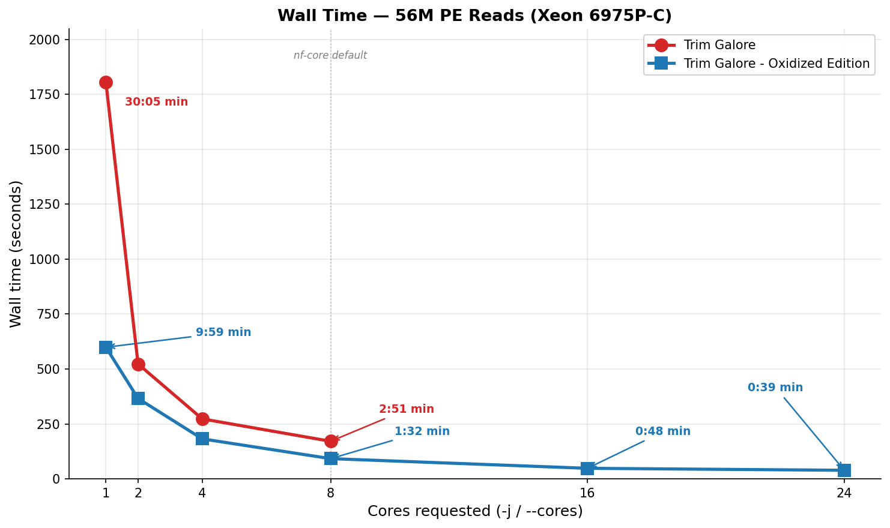
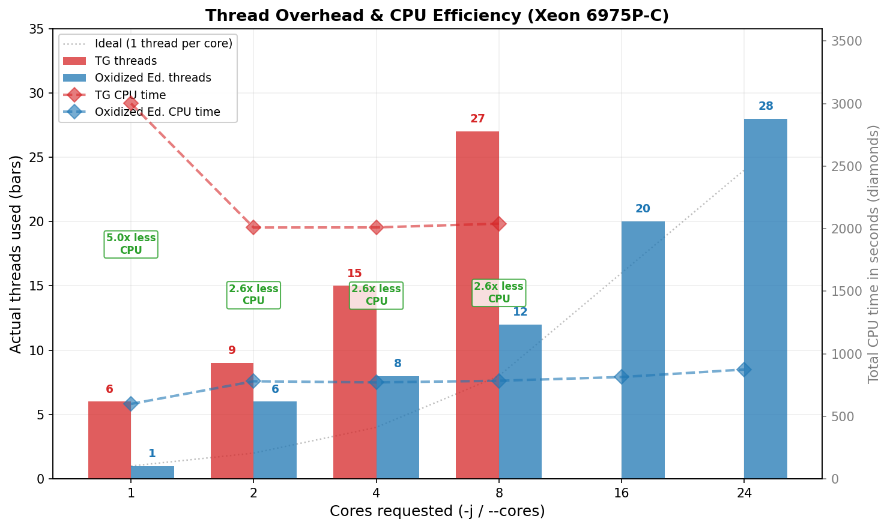
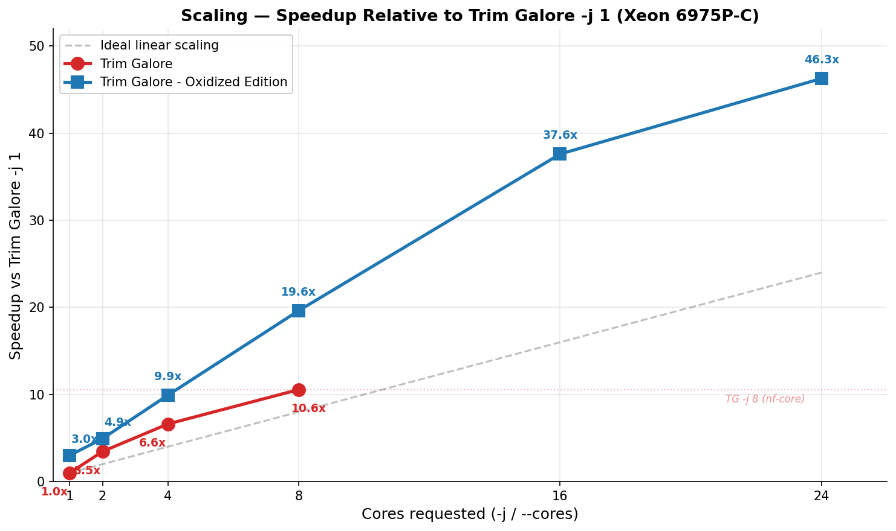

# Trim Galore — Oxidized Edition

## What was built

A complete **Rust rewrite of Trim Galore** that produces **byte-identical output** to the Perl original across every feature and test case. It's a true drop-in replacement — same CLI flags, same output filenames, same report format compatible with MultiQC.

**Architecture shift:** Trim Galore (Perl) is a wrapper that shells out to Cutadapt (Python/Cython) for adapter matching. The Oxidized Edition does everything in a single process — adapter detection, alignment, quality trimming, adapter removal, filtering — in one pass through the data. Paired-end reads are processed in a single pass rather than two sequential Cutadapt runs.

## Feature parity

| Feature | Status |
|---------|--------|
| Adapter auto-detection (Illumina/Nextera/smallRNA; `--stranded_illumina` / `--bgiseq` as explicit-flag presets) | Done |
| Quality trimming (BWA algorithm, Phred33/64) | Done |
| Adapter trimming (semi-global alignment with error rate) | Done |
| Paired-end single-pass processing | Done |
| `--rrbs` / `--non_directional` | Done |
| `--nextseq` / `--2colour` | Done |
| `--consider_already_trimmed` | Done |
| `--poly_a` trimming | Done |
| `--hardtrim5` / `--hardtrim3` | Done |
| `--clock` (Epigenetic Clock UMI) | Done |
| `--implicon` (UMI from R2) | Done |
| `--demux` (3' barcode demultiplexing) | Done |
| `--fastqc` / `--fastqc_args` | Done |
| `--rename`, `--trim-n`, `--max_n`, `--max_length` | Done |
| `--retain_unpaired`, `--clip_R1/R2`, `--three_prime_clip_R1/R2` | Done |
| `--cores N` (worker-pool parallelism) | Done |
| Trimming reports (MultiQC-compatible) | Done |
| Colorspace rejection | Done |

## Performance

**Test dataset:** 55.8M paired-end reads (SRR24827378, whole-genome bisulfite sequencing).
All outputs verified byte-identical (decompressed) across all core counts via md5 checksums.







### Server benchmark — Intel Xeon 6975P-C (32 vCPU)

#### Trim Galore (Perl 5.38 + Cutadapt 5.2 + pigz 2.8 + igzip/ISA-L for decompression)

| `-j` | Wall time | CPU time | Memory | Threads (observed) |
|-----:|----------:|---------:|-------:|-------------------:|
| 1 | 30:05 (1,805s) | 3,001s | 21 MB | up to ~6 |
| 2 | 8:43 (523s) | 2,009s | 39 MB | up to ~9 |
| 4 | 4:33 (273s) | 2,010s | 42 MB | up to ~15 |
| 8 | 2:51 (171s) | 2,040s | 61 MB | up to ~27 |

#### Trim Galore — Oxidized Edition (Rust, zlib-rs)

| `--cores` | Wall time | CPU time | Memory | Threads (deterministic) |
|----------:|----------:|---------:|-------:|------------------------:|
| 1 | 9:59 (599s) | 599s | 5 MB | 1 |
| 2 | 6:06 (366s) | 780s | 43 MB | 6 |
| 4 | 3:02 (182s) | 771s | 62 MB | 8 |
| 8 | 1:32 (92s) | 784s | 100 MB | 12 |
| 16 | 0:48 (48s) | 814s | 171 MB | 20 |
| **24** | **0:39 (39s)** | **874s** | **157 MB** | **28** |

#### Head-to-head (same core count)

| Cores | TG wall | Oxidized wall | **Wall speedup** | TG CPU | Oxidized CPU | **CPU savings** |
|------:|--------:|--------------:|-----------------:|-------:|-------------:|----------------:|
| 1 | 1,805s | 599s | **3.0x** | 3,001s | 599s | **5.0x** |
| 4 | 273s | 182s | **1.5x** | 2,010s | 771s | **2.6x** |
| 8 | 171s | 92s | **1.9x** | 2,040s | 784s | **2.6x** |

#### Production comparison: nf-core default (`--cores 8`)

In nf-core pipelines, Trim Galore is typically allocated 12 CPUs (`process_high`) and run with `-j 8` (the module subtracts 4 for overhead). With `-j 8`, TG spawns up to ~27 threads across Cutadapt workers, pigz compression, and pigz/igzip decompression. nf-core installs TG from bioconda, which includes igzip (Intel ISA-L) for decompression.

| | TG `-j 8` | Oxidized `--cores 4` | Oxidized `--cores 8` | Oxidized `--cores 24` |
|---|---|---|---|---|
| **Wall time** | 171s | 182s | **92s (1.9x faster)** | **39s (4.4x faster)** |
| **CPU time** | 2,040s | 771s (2.6x less) | 784s (2.6x less) | **874s (2.3x less)** |
| **Threads** | up to ~27 | 8 | 12 | **28** |
| **Memory** | 61 MB | 62 MB | 100 MB | 157 MB |

Three ways to read this:
- **Same speed, fewer resources:** Oxidized `--cores 4` (8 threads) matches TG `-j 8` (up to ~27 threads) in wall time, using 2.6x less CPU and a third of the threads.
- **Same resources, much faster:** Oxidized `--cores 8` uses 12 threads (fewer than TG's ~27) and is nearly **twice as fast**.
- **Comparable thread budget, 4.4x faster:** Oxidized `--cores 24` (28 threads) vs TG `-j 8` (up to ~27 threads) — finishes in **39 seconds vs 171 seconds**, using 2.3x less CPU.

### Laptop benchmark — Apple M1 Pro (10 cores)

#### Trim Galore (Perl 5.34 + Cutadapt 4.9 + pigz)

| `-j` | Wall time | CPU time |
|-----:|----------:|---------:|
| 1 | 27:04 (1,624s) | 2,536s |
| 2 | 13:50 (830s) | 2,741s |
| 4 | 7:15 (435s) | 2,868s |

#### Trim Galore — Oxidized Edition

| `--cores` | Wall time | CPU time | Speedup vs TG `-j 1` |
|----------:|----------:|---------:|----------------------:|
| 1 | 11:46 (706s) | 695s | 2.3x |
| 2 | 7:16 (436s) | 908s | 3.7x |
| 4 | 3:46 (226s) | 936s | 7.2x |
| 6 | 2:35 (155s) | 957s | 10.5x |
| 8 | 2:03 (123s) | 994s | 13.2x |

### Why the speedup is larger than "Rust is faster"

**The bottleneck is gzip, not trimming.** The actual trimming logic (adapter alignment, quality clipping) is ~5% of runtime — the other 95% is gzip compression (~60%) and decompression (~30%). Rust's speed advantage over Perl/Python only applies to that 5%.

The real wins come from **architectural differences:**

1. **Single-pass vs three-pass.** Trim Galore runs Cutadapt on R1, then R2, then pair-validates — reading and recompressing the data three separate times. The Oxidized Edition does everything in one pass.

2. **Worker-pool parallelism.** Each worker independently handles trimming **and** gzip compression for its batch of reads, producing independently-compressed gzip blocks concatenated in order (valid per RFC 1952). This distributes the dominant cost (compression) across N workers instead of funneling through one thread.

3. **Fewer threads, more work per thread.** When you pass `-j N` to Trim Galore, three separate programs each independently spawn threads. The theoretical maximum is approximately 3N+3, though not all threads are necessarily active simultaneously:

```
Trim Galore -j N thread breakdown (theoretical maximum):
  Cutadapt:                    N workers + 1 reader + 1 writer  =  N+2
  pigz (compress):             N threads                         =  N
  pigz/igzip (decompress):     up to N threads                   ≈  N
  Perl:                        1 main process                    =  1
                                                                 ≈ 3N+3 total
```

Note: The nf-core trimgalore module accounts for this by reserving `task.cpus - 4` cores for the `-j` flag (e.g., 12 allocated CPUs → `-j 8`). Thread counts above were observed via `ps` during benchmarking and represent approximate peak values.

The Oxidized Edition uses a single process with a fixed infrastructure cost of +4 threads:

```
Oxidized Edition --cores N thread breakdown:
  N worker threads (each: trim + gzip compress → independent gzip block)
  2 decompression threads (one per input file)
  1 batcher thread (creates numbered batches of 4096 reads)
  1 main thread (collects blocks in order → writes to output files)
                                                       = N+4 total
```

At `--cores 1`, the worker-pool is bypassed entirely — a single thread does everything with zero parallelism overhead (1 thread, 5 MB RAM). The infrastructure cost only applies from `--cores 2` upward, where each additional core adds exactly 1 thread and ~10 MB of memory.

| Cores | TG threads (up to ~3N+3) | Oxidized threads (N+4) |
|------:|-------------------------:|-----------------------:|
| 1 | up to ~6 | 1 |
| 4 | up to ~15 | 8 |
| 8 | up to ~27 | 12 |
| 16 | — | 20 |

At `-j 8` vs `--cores 8`: up to ~27 vs exactly 12 threads, yet 1.9x faster.

Parallel efficiency on the Xeon: 82% (2 cores) → 82% (4 cores) → 81% (8 cores) → 78% (16 cores) → 64% (24 cores). Scaling remains near-linear up to 16 cores, with diminishing returns beyond that. For most production use, `--cores 8` to `--cores 16` is the sweet spot — beyond 16, additional cores still help but deliver progressively less benefit per core.

### Benchmark methodology

- **Timing:** All wall time, CPU time, and peak memory measured via `/usr/bin/time -v`.
- **Thread counts (TG):** Observed via `ps` during execution — these are approximate peak values, as threads are spawned across three independent subprocesses (Cutadapt, pigz, pigz/igzip) whose lifetimes may not fully overlap.
- **Thread counts (Oxidized):** Deterministic from the architecture: exactly N+4 threads for `--cores N` (N workers + 2 decompressors + 1 batcher + 1 writer), or exactly 1 thread for `--cores 1`.
- **igzip:** The bioconda Trim Galore installation includes igzip (Intel ISA-L) for fast single-threaded decompression. Benchmarks were re-run with igzip to match the nf-core production environment; the difference was <1% (decompression is not the bottleneck — compression is).
- **Outputs verified:** All outputs were confirmed byte-identical (decompressed) between TG and Oxidized across all core counts via md5 checksums.

## Beyond speed

- **Zero external dependencies:** No Python, no Cutadapt, no pigz. Single static binary.
- **Simpler deployment:** `cargo install` or download a binary. No conda environment needed.
- **Single-pass paired-end:** Both reads processed together — guaranteed synchronization, no temp files.
- **Lower memory:** 5 MB single-threaded, ~10 MB per additional worker. No Python interpreter, no subprocess pipes.
- **CPU-efficient:** Uses 2.6–5x less CPU time than Trim Galore — meaningful on shared HPC clusters where CPU-hours = money.
- **Reproducible:** Pure Rust with deterministic behavior across platforms.
- **New features:** Poly-G trimming (auto-detected for 2-colour instruments like NovaSeq/NextSeq) and poly-A trimming, both built in without external tools.

## Why switch to Trim Galore - Oxidized Edition?

The improvements are multilayered — there is no single "60x faster" headline, because the gains compound across several dimensions simultaneously:

### 1. Faster wall time at the same resource allocation

At the typical nf-core allocation of 12 CPUs, the Oxidized Edition with `--cores 8` finishes in **92 seconds vs 171 seconds** — nearly **twice as fast**. With `--cores 16`, it drops to **48 seconds (3.6x faster)** while still scaling efficiently. This means shorter pipeline runtimes, faster turnaround on time-sensitive analyses, and less queuing pressure on shared clusters.

### 2. Dramatically lower CPU cost — and CO₂

The Oxidized Edition uses **2.3–5x less CPU time** than Trim Galore for the same job. CPU time is what cloud providers bill for and what drives energy consumption:

| Scenario | TG CPU time | Oxidized CPU time | **CPU savings** |
|---|---|---|---|
| Single-threaded | 3,001s | 599s | **5.0x** |
| 8 cores (nf-core default) | 2,040s | 784s | **2.6x** |

On AWS at ~$0.05/vCPU-hour, trimming 56M PE reads costs roughly **$0.34 with TG** vs **$0.13 with Oxidized** (at 8 cores). Across thousands of samples in a large cohort, this adds up to meaningful savings in both budget and carbon footprint.

### 3. More features, fewer dependencies

The Oxidized Edition includes features not available in vanilla Trim Galore:
- **Poly-G trimming** with data-driven auto-detection for 2-colour instruments (NovaSeq, NextSeq, NovaSeq X) — no need for separate tools or manual `--nextseq` flags
- **Poly-A trimming** for 3' poly-A tail removal
- **Single binary** with zero external dependencies — no Python, no Cutadapt, no pigz, no conda environment

### 4. Recommended core allocation

Based on the benchmarks, we recommend `--cores 8` to `--cores 16` for production use. Scaling is near-linear up to 16 cores (78% parallel efficiency), with diminishing returns beyond that. For nf-core pipelines, the Oxidized Edition can use the full CPU allocation directly — no need to subtract cores for subprocess overhead, since everything runs in a single process.
