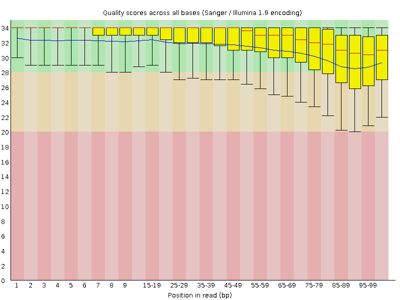

# Taking appropriate QC measures for RRBS-type or other -seq applications with Trim Galore

#### Table of Contents
* [Introduction](#introduction)
* [Methodology](#adaptive-quality-and-adapter-trimming-with-trim-galore)
  1. [Quality Trimming](#step-1-quality-trimming)
  2. [Adapter Trimming](#step-2-adapter-trimming)
    - [Auto-detection](#adapter-auto-detection)
    - [Manual adapter sequence specification](#manual-adapter-sequence-specification)
  3. [Removing Short Sequences](#step-3-removing-short-sequences)
  4. [Specialised Trimming — hard-trim, Epigenetic Clock, IMPLICON](#step-4-specialised-trimming)
* [Flag reference](#flag-reference)
  * [Cross-flag interactions](#cross-flag-interactions)
  * [RRBS-specific guidance](#rrbs-specific-guidance)
  * [Adapter specification — recap](#adapter-specification--recap)
* [Appendix: Understanding the trimming report](#understanding-the-trimming-reports) 

## Introduction

For all high throughput sequencing applications, we would recommend performing some quality control on the data, as it can often straight away point you towards the next steps that need to be taken (e.g. with [FastQC](http://www.bioinformatics.babraham.ac.uk/projects/fastqc/)). Thorough quality control and taking appropriate steps to remove problems is vital for the analysis of almost all sequencing applications. This is even more critical for the proper analysis of RRBS libraries since they are susceptible to a variety of errors or biases that one could probably get away with in other sequencing applications. In our [brief guide to RRBS](https://github.com/FelixKrueger/TrimGalore/blob/master/Docs/RRBS_Guide.pdf) we discuss the following points:

* poor qualities – affect mapping, may lead to incorrect methylation calls and/or mis-mapping
* adapter contamination – may lead to low mapping efficiencies, or, if mapped, may result in incorrect methylation calls and/or mis-mapping
* positions filled in during end-repair will infer the methylation state of the cytosine used for the fill-in reaction but not of the true genomic cytosine
* paired-end RRBS libraries (especially with long read length) yield redundant methylation information if the read pairs overlap
* RRBS libraries with long read lengths suffer more from all of the above due to the short size- selected fragment size


Poor base call qualities or adapter contamination are however just as relevant for 'normal', i.e. non-RRBS, libraries.


## Adaptive quality and adapter trimming with Trim Galore

Trim Galore handles quality trimming, adapter detection, adapter removal, length filtering, and specialty modes in a single pass over the data, with optional post-trimming quality reporting via [FastQC](http://www.bioinformatics.babraham.ac.uk/projects/fastqc/). Originally a Perl wrapper around [Cutadapt](https://cutadapt.readthedocs.io/en/stable/), v2.x is a faithful Rust rewrite that consolidates those passes while preserving the CLI and output filename conventions.

Even though Trim Galore works for any (base space) high throughput dataset (e.g. downloaded from the SRA) this section describes its use mainly with respect to RRBS libraries.

> [!NOTE]
> The Oxidized Edition (v2.x) is a faithful Rust rewrite designed as a drop-in replacement for v0.6.x. All of the trimming steps below happen in a single pass over the data rather than as sequential Cutadapt invocations. Outputs match v0.6.x for the core feature set; newer capabilities (e.g. `--poly_g` auto-detection, a generic `--poly_a` trimmer) extend beyond the Perl version.

### Step 1: Quality Trimming
In the first step, low-quality base calls are trimmed off from the 3' end of the reads before adapter removal. This efficiently removes poor quality portions of the reads.


|    |   |
|:--------:|:---:|
| **Before Quality Trimming** | **After Quality Trimming** |
|    |   |

> Here is an example of a dataset downloaded from the SRA which was trimmed with a Phred score threshold of 20 (data set DRR001650_1 from Kobayashi et al., 2012).

### Step 2: Adapter Trimming
In the next step, Trim Galore finds and removes adapter sequences from the 3’ end of reads.

#### Adapter auto-detection
If no sequence was supplied, Trim Galore will attempt to auto-detect the adapter that has been used. For this it will analyse the first 1 million sequences of the first specified file and count exact substring matches against a set of standard adapter probes:

```
Illumina:   AGATCGGAAGAGC                     (13 bp)
Small RNA:  TGGAATTCTCGG                      (12 bp)
Nextera:    CTGTCTCTTATA                      (12 bp)
BGI/DNBSEQ: AAGTCGGAGGCCAAGCGGTCTTAGGAAGACAA  (32 bp; v2.x addition)
```

If no adapter contamination can be detected within the first 1 million sequences — or in case of a tie — Trim Galore defaults to `--illumina`. The auto-detection results are shown on screen and printed to the trimming report for future reference.

The Stranded Illumina adapter (`ACTGTCTCTTATA`) is intentionally not auto-detected: it differs from the Nextera adapter by a single A-tail base, so probing both would produce constant ambiguous ties. Pass `--stranded_illumina` explicitly when working with those libraries.


#### Multiple adapter sequences

Multiple adapters can be specified in three equivalent ways. The cleanest (v2.x) is simply to repeat `-a` and/or `-a2`:

```
-a AGCTCCCG -a TTTCATTATAT -a TTTATTCGGATTTAT -n 3
-a2 AGCTAGCG -a2 TCTCTTATAT -a2 TTTCGGATTTAT -n 3
```

The v0.6.x embedded-string form is still accepted for backwards compatibility:

```
-a  " AGCTCCCG -a TTTCATTATAT -a TTTATTCGGATTTAT"
-a2 " AGCTAGCG -a TCTCTTATAT -a TTTCGGATTTAT"
```

Or load adapters from a FASTA file:

```
-a "file:../multiple_adapters.fa"
-a2 "file:../different_adapters.fa"
```

For all three forms, adding `-n 3` lets Trim Galore strip up to three adapter occurrences from each read — useful when adapter contamination can appear multiple times in the same read. Standard trimming does not require `-n`. More information can be found in [Issue 86](https://github.com/FelixKrueger/TrimGalore/issues/86).

Single-base expansion (`A{10}` → `AAAAAAAAAA`) is also supported for both `-a` and `-a2`, matching Perl v0.6.x syntax.

#### Manual adapter sequence specification
The auto-detection behaviour can be overruled by specifying an adapter sequence manually or by using `--illumina`, `--nextera` or `--small_rna`, or `--stranded_illumina` (see `--help` for more details). **Please note**: the first 13 bp of the standard Illumina paired-end adapters (`AGATCGGAAGAGC`) recognise and removes adapter from most standard libraries, including the Illumina TruSeq and Sanger iTag adapters. This sequence is present on both sides of paired-end sequences, and is present in all adapters before the unique Index sequence occurs. So for any 'normal' kind of sequencing you do not need to specify anything but `--illumina`, or better yet just use the auto-detection. 

To control the stringency of the adapter removal process one gets to specify the minimum number of required overlap with the adapter sequence; else it will default to 1. This default setting is extremely stringent, i.e. an overlap with the adapter sequence of even a single bp is spotted and removed. This may appear unnecessarily harsh; however, as a reminder adapter contamination may in a Bisulfite-Seq setting lead to mis-alignments and hence incorrect methylation calls, or result in the removal of the sequence as a whole because of too many mismatches in the alignment process.

Tolerating adapter contamination is most likely detrimental to the results, but we realize that this process may in some cases also remove some genuine genomic sequence. It is unlikely that the removed bits of sequence would have been involved in methylation calling anyway (since only the 4th and 5th adapter base would possibly be involved in methylation calls, for directional libraries). However, it is quite likely that true adapter contamination – irrespective of its length – would be detrimental for the alignment or methylation call process, or both.

| **Before Adapter Trimming** | **After Adapter Trimming** |
|:--------:|:---:|
|    |   |


> This example (same dataset as above) shows the dramatic effect of adapter contamination on the base composition of the analysed library, e.g. the C content rises from ~1% at the start of reads to around 22% (!) towards the end of reads. Adapter trimming gets rid of most signs of adapter contamination efficiently. Note that the sharp decrease of A at the last position is a result of removing the adapter sequence very stringently, i.e. even a single trailing A at the end is removed.


#### RRBS Mode
Trim galore! also has an `--rrbs` option for DNA material that was digested with the restriction enzyme MspI. In this mode, Trim Galore identifies sequences that were adapter-trimmed and removes another 2 bp from the 3' end of Read 1, and for paired-end libraries also the first 2 bp of Read 2 (which is equally affected by the fill-in procedure). This is to avoid that the filled-in cytosine position close to the second MspI site in a sequence is used for methylation calls. Sequences which were merely trimmed because of poor quality will not be shortened any further.

#### Non-directional mode
Trim Galore also has a `--non_directional` option, which will screen adapter-trimmed sequences for the presence of either CAA or CGA at the start of sequences and clip off the first 2 bases if found. If CAA or CGA are found at the start, no bases will be trimmed off from the 3’ end even if the sequence had some contaminating adapter sequence removed (in this case the sequence read likely originated from either the CTOT or CTOB strand; refer to [the RRBS guide](https://github.com/FelixKrueger/TrimGalore/blob/master/Docs/RRBS_Guide.pdf) for the meaning of CTOT and CTOB strands).

### Step 3: Removing Short Sequences
Lastly, since quality and/or adapter trimming may result in very short sequences (sometimes as short as 0 bp), Trim Galore can filter trimmed reads based on their sequence length (default: 20 bp). This is to reduce the size of the output file and to avoid crashes of alignment programs which require sequences with a certain minimum length.

#### Paired-End Data
Note that it is not recommended to remove too-short sequences if the analysed FastQ file is one of a pair of paired-end files, since this confuses the sequence-by-sequence order of paired-end reads which is again required by many aligners. For paired-end files, Trim Galore has an option `--paired` which runs a paired-end validation on both trimmed `_1` and `_2` FastQ files once the trimming has completed. This step removes entire read pairs if at least one of the two sequences became shorter than a certain threshold. If only one of the two reads is longer than the set threshold, e.g. when one read has very poor qualities throughout, this singleton read can be written out to unpaired files (see option `retain_unpaired`) which may be aligned in a single-end manner.


Applying these steps to both self-generated and downloaded data can ensure that you really only use the high quality portion of the data for alignments and further downstream analyses and conclusions.

### Step 4: Specialised Trimming

> [!NOTE]
> All specialty modes accept multi-pair input. `--hardtrim5` / `--hardtrim3` are single-end-shaped and just process every input file independently. `--clock` and `--implicon` are paired-end-shaped and accept any even number of inputs as consecutive R1/R2 pairs (e.g. `--clock A_R1.fq.gz A_R2.fq.gz B_R1.fq.gz B_R2.fq.gz`). Same pairwise-order requirement as `--paired` applies — a glob like `*fastq.gz` produces alphabetically-sorted output, which for `_R1`/`_R2` naming gives the right pairwise order, but mixed naming may not.

#### Hard-trimming to leave bases at the 5'-end
The option `--hardtrim5 INT` allows you to hard-clip sequences from their 3' end. This option processes one or more files (plain FastQ or gzip compressed files) and produces hard-trimmed FastQ files ending in `.{INT}bp_5prime.fq(.gz)`. This is useful when you want to shorten reads to a certain read length. Here is an example:

```
before:         CCTAAGGAAACAAGTACACTCCACACATGCATAAAGGAAATCAAATGTTATTTTTAAGAAAATGGAAAAT
--hardtrim5 20: CCTAAGGAAACAAGTACACT
```

#### Hard-trimming to leave bases at the 3'-end
The option `--hardtrim3 INT` allows you to hard-clip sequences from their 5' end. This option processes one or more files (plain FastQ or gzip compressed files) and produces hard-trimmed FastQ files ending in `.{INT}bp_3prime.fq(.gz)`. We found this quite useful in a number of scenarios where we wanted to remove biased residues from the start of sequences. Here is an example :

```
before:         CCTAAGGAAACAAGTACACTCCACACATGCATAAAGGAAATCAAATGTTATTTTTAAGAAAATGGAAAAT
--hardtrim3 20:                                                   TTTTTAAGAAAATGGAAAAT
```


#### Mouse Epigenetic Clock trimming
The option `--clock` trims reads in a specific way that is currently used for the Mouse Epigenetic Clock (see here: [Multi-tissue DNA methylation age predictor in mouse, Stubbs et al., Genome Biology, 2017 18:68](https://genomebiology.biomedcentral.com/articles/10.1186/s13059-017-1203-5)). Following the trimming, Trim Galore exits.

In its current implementation, the dual-UMI RRBS reads come in the following format:

```
Read 1  5' UUUUUUUU CAGTA FFFFFFFFFFFFFFFFFFFFFFFFFFFFFFFFFFFF TACTG UUUUUUUU 3'
Read 2  3' UUUUUUUU GTCAT FFFFFFFFFFFFFFFFFFFFFFFFFFFFFFFFFFFF ATGAC UUUUUUUU 5'
```

Where UUUUUUUU is a random 8-mer unique molecular identifier (UMI), CAGTA is a constant region,
and FFFFFFF... is the actual RRBS-Fragment to be sequenced. The UMIs for Read 1 (R1) and
Read 2 (R2), as well as the fixed sequences (F1 or F2), are written into the read ID and
removed from the actual sequence. Here is an example:

```
R1: @HWI-D00436:407:CCAETANXX:1:1101:4105:1905 1:N:0: CGATGTTT
    ATCTAGTTCAGTACGGTGTTTTCGAATTAGAAAAATATGTATAGAGGAAATAGATATAAAGGCGTATTCGTTATTG
R2: @HWI-D00436:407:CCAETANXX:1:1101:4105:1905 3:N:0: CGATGTTT
    CAATTTTGCAGTACAAAAATAATACCTCCTCTATTTATCCAAAATCACAAAAAACCACCCACTTAACTTTCCCTAA

R1: @HWI-D00436:407:CCAETANXX:1:1101:4105:1905 1:N:0: CGATGTTT:R1:ATCTAGTT:R2:CAATTTTG:F1:CAGT:F2:CAGT
                 CGGTGTTTTCGAATTAGAAAAATATGTATAGAGGAAATAGATATAAAGGCGTATTCGTTATTG
R2: @HWI-D00436:407:CCAETANXX:1:1101:4105:1905 3:N:0: CGATGTTT:R1:ATCTAGTT:R2:CAATTTTG:F1:CAGT:F2:CAGT
                 CAAAAATAATACCTCCTCTATTTATCCAAAATCACAAAAAACCACCCACTTAACTTTCCCTAA
```
Following clock trimming, the resulting files (`.clock_UMI.R1.fq(.gz)` and `.clock_UMI.R2.fq(.gz)`) should be adapter- and quality-trimmed with a second Trim Galore run. Even though the data is technically RRBS, it doesn't require the `--rrbs` option. Instead the reads need to be trimmed by 15 bp from their 3' end to get rid of potential UMI and fixed sequences. For a single sample:

```
trim_galore --paired --three_prime_clip_R1 15 --three_prime_clip_R2 15 sample.clock_UMI.R1.fq.gz sample.clock_UMI.R2.fq.gz
```

For multiple samples, `--paired` requires input files in pairwise (R1, R2, R1, R2, …) order — don't use `*R1.fq.gz *R2.fq.gz` globs which produce all-R1s-then-all-R2s. Either invoke once per sample, or interleave explicitly.

Following this, reads should be aligned with Bismark and deduplicated with UmiBam in `--dual_index` mode (see here: https://github.com/FelixKrueger/Umi-Grinder). UmiBam recognises the UMIs within this pattern: `R1:(`**ATCTAGTT**`):R2:(`**CAATTTTG**`):` as UMI R1 = **ATCTAGTT** and UMI R2 = **CAATTTTG**.

#### IMPLICON UMI transfer

The option `--implicon` is a similar run-and-exit specialty mode for paired-end libraries where the UMI lives at the 5' end of Read 2 only. It transfers the first `N` bases of R2 into the read ID of both reads (as `:BARCODE`), then clips R2 by `N` bases. Read 1 is otherwise untouched. In Perl v0.6.x the UMI length was hardcoded at 8 bp; v2.x takes an optional value (`--implicon=12`, for example) with a default of 8.

Output filenames follow the pattern `{stem}_{N}bp_UMI_R1.fastq(.gz)` / `{stem}_{N}bp_UMI_R2.fastq(.gz)`. Like `--clock`, Trim Galore exits after the transfer; the resulting files are then run through a second Trim Galore invocation for adapter and quality trimming.


## Flag reference

Run `trim_galore --help` for the complete list of options with one-line descriptions and default values. This section focuses on flag interactions and scenarios that benefit from more context than the terse `--help` output.

### Cross-flag interactions

A few combinations are worth knowing about:

- **`--small_rna`** lowers the `--length` default to 18 bp (from 20) and auto-sets `--adapter2` to the Illumina small RNA 5' adapter (`GATCGTCGGACT`) for paired-end data.
- **`--rrbs`** in paired-end directional mode auto-sets `--clip_R2 2` to mask the 2 bp end-repair bias at the start of Read 2, unless the user provides their own `--clip_R2` value. `--non_directional` intentionally skips this auto-clip.
- **`--paired` + `--length`** discards the whole read pair unless *both* reads pass the length cutoff. To rescue the surviving read when only one becomes too short, add `--retain_unpaired`; the per-side cutoff is governed by `--length_1`/`--length_2` (default 35 bp each).
- **`--trim-n`** is suppressed under `--rrbs` (matches Perl v0.6.x — N-trimming interacts poorly with RRBS end-repair masking).
- **`--discard_untrimmed`** keeps only reads where at least one adapter match was found. For paired-end, the pair is discarded only if *neither* read had an adapter.
- **`--poly_g`** is auto-enabled when the data looks like it came from a 2-colour instrument (sequence-based detection on trailing G-runs). Use `--no_poly_g` to force-disable, or `--poly_g` to force-enable. It is independent of `--nextseq` (which is quality-score-based).

### RRBS-specific guidance

**Tecan Ovation RRBS Methyl-Seq kit (with or without TrueMethyl oxBS 1-16):** the Tecan kit attaches a varying number of nucleotides (0-3) after each MspI site, so standard `--rrbs` 2 bp 3'-trimming over-trims. Run Trim Galore *without* `--rrbs` and handle the fill-in via Tecan's subsequent diversity-trimming step (see their manual).

**MseI-digested RRBS libraries:** if your DNA was digested with MseI (recognition motif `TTAA`) instead of MspI, you do **not** need `--rrbs` or `--non_directional`. Virtually all reads should start with `TAA`, and the end-repair of TAA-restricted sites does not involve cytosines, so no special treatment is required. Just run Trim Galore in the default (non-RRBS) mode.

### Adapter specification — recap

See [Multiple adapter sequences](#multiple-adapter-sequences) above for the three equivalent syntaxes (repeatable `-a`/`-a2`, embedded-string form, and `file:adapters.fa`). Supplementary notes:

- Single-base expansion `-a A{N}` / `-a2 A{N}` repeats the base `N` times, matching Perl v0.6.x syntax.
- Adapter auto-detection runs **per pair** in v2.x (Perl ran it once per invocation), so a shell glob `trim_galore --paired *fastq.gz` correctly handles multiple samples with different library types or 2-colour/4-colour chemistries.
- `--consider_already_trimmed <INT>` suppresses adapter trimming entirely when no auto-detect probe exceeds that count (quality trimming still runs). Useful for feeding already-trimmed data through Trim Galore for QC reporting without over-trimming.

## Understanding the trimming reports

Trimming reports are generated by Trim Galore in a Cutadapt-compatible format so existing MultiQC parsers continue to work unchanged. Users migrating from v0.6.x will recognise the structure: v2.x does the work in a single process rather than interleaving output from a Cutadapt subprocess, but the emitted text still begins with a `This is cutadapt ... (compatible; for MultiQC backwards compatibility)` banner so downstream tools parse it correctly.

Reports consist of three sections:

1. Parameter summary
2. Cutadapt-compatible trimming summary
3. Run statistics summary

### 1. Parameter summary

Written out right at the start of the run. Example (paired-end, default options):

```
SUMMARISING RUN PARAMETERS
==========================
Input filename: SLX_R1.fastq.gz
Trimming mode: paired-end
Trim Galore version: 2.1.0 (Oxidized Edition)
Quality Phred score cutoff: 20
Quality encoding type selected: ASCII+33
Using Illumina adapter for trimming (count: 18772). Second best hit was smallRNA (count: 0)
Adapter sequence: 'AGATCGGAAGAGC' (Illumina TruSeq, Sanger iPCR; auto-detected)
Maximum trimming error rate: 0.1
Minimum required adapter overlap (stringency): 1 bp
Minimum required sequence length for both reads before a sequence pair gets removed: 20 bp
Output file will be GZIP compressed
```

The parameter summary in v2.x is slightly slimmer than the v0.6.x equivalent: entries like `Cutadapt version:`, `Python version:`, the per-core annotation, and FastQC/clip status lines are not emitted. Cutadapt and Python are not subprocesses in v2.x, and clipping is applied silently during trimming rather than logged here.

### 2. Cutadapt-compatible trimming summary

After the parameter block, Trim Galore emits a MultiQC-compatible summary that downstream parsers familiar with the Perl/Cutadapt output recognise unchanged. The block starts with two header lines that identify the edition:

```
Trim Galore 2.1.0 (Oxidized Edition) — adapter trimming built in
This is cutadapt 4.0 (compatible; for MultiQC backwards compatibility)
Command line parameters: -j 1 -e 0.1 -q 20 -O 1 -a AGATCGGAAGAGC SLX_R1.fastq.gz
Processing reads on 1 core in single-end mode ...

=== Summary ===

Total reads processed:           1,166,076,593
Reads with adapters:               467,751,243 (40.1%)
Reads written (passing filters): 1,166,076,593 (100.0%)

Total basepairs processed: 174,911,488,950 bp
Quality-trimmed:             674,749,563 bp (0.4%)
Total written (filtered):  172,939,327,763 bp (98.9%)
```

> **Note:** `Reads written (passing filters)` always shows 100% in this block — length and N-content filtering happens in a downstream step, not here. The true discard counts appear in the Run statistics summary below. See [issue #200](https://github.com/FelixKrueger/TrimGalore/issues/200) for background.

The per-adapter detail block follows:

```
=== Adapter 1 ===

Sequence: AGATCGGAAGAGC; Type: regular 3'; Length: 13; Trimmed: 467751243 times.

No. of allowed errors:
1-9 bp: 0; 10-13 bp: 1

Overview of removed sequences
length	count	expect	max.err	error counts
1	316729650	291519148.2	0	316729650
2	81494061	72879787.1	0	81494061
3	27821736	18219946.8	0	27821736
...
150	3937	17.4	1	102 3835
```

If multiple adapters were configured (via repeated `-a`, inline `-a " SEQ -a SEQ"`, or a FASTA file), each gets its own `=== Adapter N ===` block.

### 3. Run statistics summary

Written at the end of the report. For **single-end** input it is a short block after the adapter details:

```
RUN STATISTICS FOR INPUT FILE: SE.fastq.gz
=============================================
1000000 sequences processed in total
Sequences removed because they became shorter than the length cutoff of 20 bp: 552 (0.1%)
```

For **paired-end** input, the validation step that discards under-length pairs runs after both per-file reports are emitted, so:

- The Read 1 report shows only `N sequences processed in total` (no post-validation stats).
- The Read 2 report carries the final paired-end validation counts at the very end:

```
RUN STATISTICS FOR INPUT FILE: SLX_R2.fastq.gz
=============================================
1166076593 sequences processed in total

Total number of sequences analysed for the sequence pair length validation: 1166076593

Number of sequence pairs removed because at least one read was shorter than the length cutoff (20 bp): 3357967 (0.29%)
```

It is this number — `3,357,967 (0.29%)` at the end of the Read 2 trimming report — that represents the total number of read pairs removed from both Read 1 and Read 2 files because of filtering (min length, max length, or max N).

---

*Trim Galore was originally developed at [Babraham Bioinformatics](https://www.bioinformatics.babraham.ac.uk/). Current development is at [github.com/FelixKrueger/TrimGalore](https://github.com/FelixKrueger/TrimGalore).*
