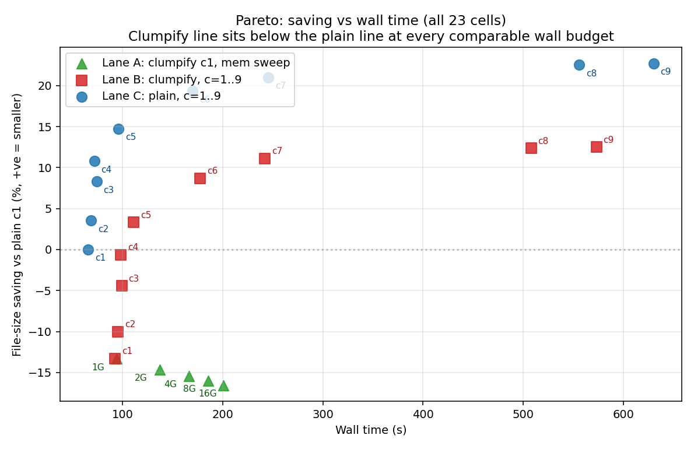
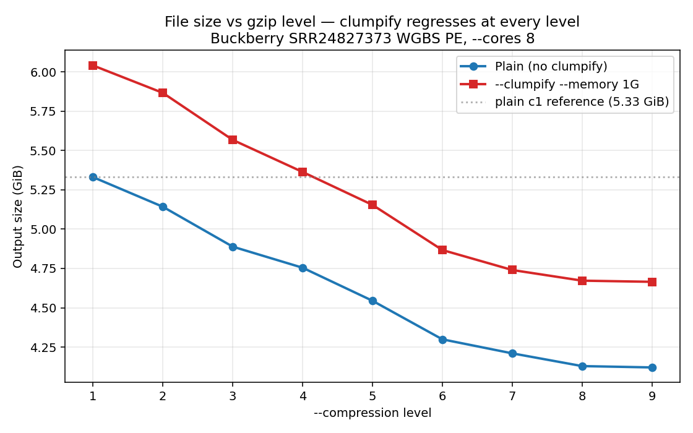
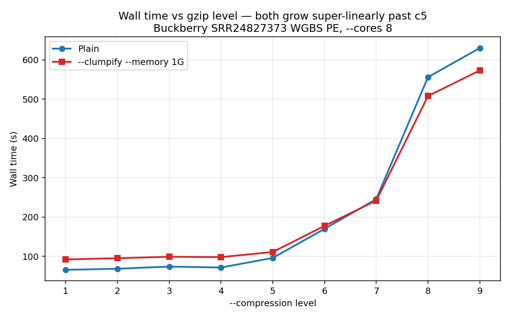
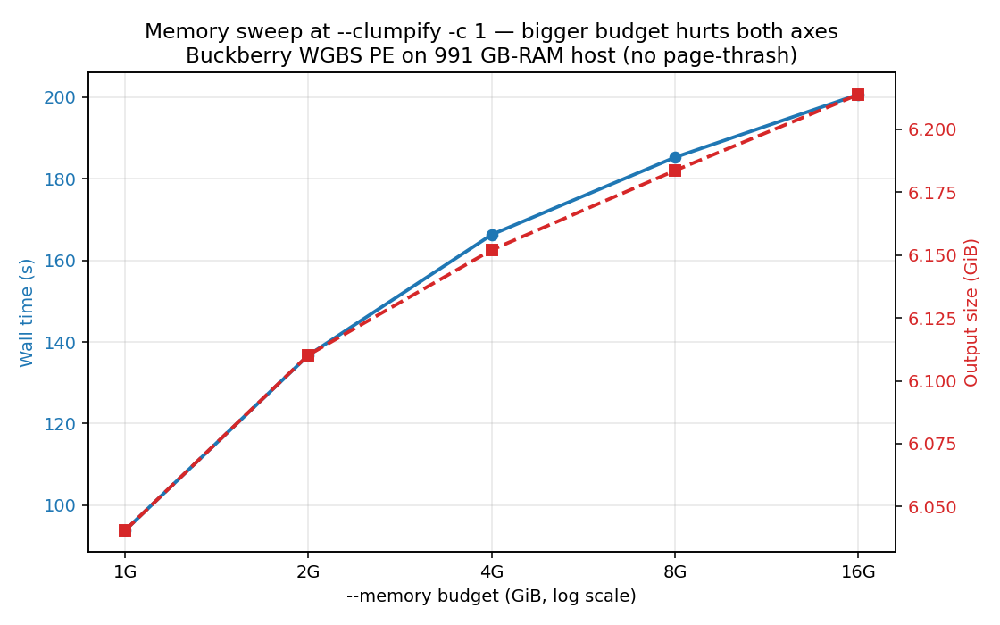

# Clumpify benchmark — Buckberry SRR24827373 WGBS PE

**TL;DR:** On whole-genome bisulfite-seq paired-end data, `--clumpify` makes
output **bigger** at every gzip level (~10–13 ppt worse than plain at the
same `-c`). Larger `--memory` budgets do not recover the loss — they make
both wall time and output size slightly worse, ruling out 16 GiB-host
page-thrash as the explanation. The R2-disruption mechanism Phil isolated
for 10x scRNA-seq generalises here: paired-end data where R1 isn't tightly
peak-clustered hurts R2 by forcing pair-lockstep ordering.

> **See also: [RRBS sister benchmark](../clumpify-rrbs-2026-05-07/)** — same matrix on MspI-digested RRBS, opposite outcome (clumpify *wins* at every level). The WGBS-vs-RRBS contrast is the cleanest mechanism evidence we have for clumpify's fragment-clustering dependency.

## Setup

- **Host:** dockyard-oxy-0 (AL2023 x86_64, 128 cores, 991 GB RAM)
- **TG version:** 2.1.0 (Oxidized Edition), commit `3fd0454` (Phil's clumpify branch)
- **Fixture:** Buckberry SRR24827373 WGBS, ~84M PE reads, 4.6 GiB gzipped
- **Methodology:** `hyperfine --warmup 1 --runs 1` per cell, `/usr/bin/time -v` for peak RSS
- **Fixed:** `--cores 8`, paired-end
- **Total wall:** 2 h 42 min (sentinel + 23 cells)
- **Reference:** plain `--compression 1` = **5.331 GiB** (the 0% line)

> All sizes in this report use **GiB** (binary, 1024³ bytes) for consistency
> with the source byte counts. Multiply by 1.0737 for decimal GB.

## Headline plot

The plain line (blue) dominates the clumpify line (red) at every wall
budget — there is no clumpify configuration that saves more disk than
plain at the same wall time. (Lane A, green triangles, adds memory
budget as a third axis but stays in the negative-saving quadrant
throughout.)

## Lane B vs Lane C: file-size sweep across compression levels 1–9

| `-c` | Plain size (GiB) | Plain saving | Clumpify size (GiB) | Clumpify saving | Δ vs same-level plain |
|---:|---:|---:|---:|---:|---:|
| 1 | 5.331 | +0.0% | 6.041 | -13.3% | **-13.3 ppt** |
| 2 | 5.142 | +3.5% | 5.866 | -10.0% | **-13.6 ppt** |
| 3 | 4.888 | +8.3% | 5.567 | -4.4% | **-12.7 ppt** |
| 4 | 4.754 | +10.8% | 5.363 | -0.6% | **-11.4 ppt** |
| 5 | 4.544 | +14.8% | 5.154 | +3.3% | **-11.4 ppt** |
| 6 | 4.299 | +19.3% | 4.867 | +8.7% | **-10.7 ppt** |
| 7 | 4.210 | +21.0% | 4.740 | +11.1% | **-9.9 ppt** |
| 8 | 4.129 | +22.5% | 4.672 | +12.4% | **-10.2 ppt** |
| 9 | 4.121 | +22.7% | 4.665 | +12.5% | **-10.2 ppt** |

The "Δ vs same-level plain" column is the cost of `--clumpify` in
percentage points of saving against plain at the same `--compression`:
clumpify never wins on this data, with a flat ~10–13 ppt penalty across
the entire sweep.

## Wall time across compression levels

| `-c` | Plain wall (s) | Clumpify wall (s) | Clumpify slowdown |
|---:|---:|---:|---:|
| 1 | 65.6 | 92.3 | 1.41× |
| 2 | 68.5 | 95.2 | 1.39× |
| 3 | 73.9 | 98.9 | 1.34× |
| 4 | 71.6 | 98.0 | 1.37× |
| 5 | 95.9 | 111.1 | 1.16× |
| 6 | 169.9 | 177.5 | 1.05× |
| 7 | 245.6 | 242.0 | 0.99× |
| 8 | 556.1 | 508.1 | 0.91× |
| 9 | 630.2 | 573.2 | 0.91× |

c1–c4 are dominated by trim+I/O cost (mostly flat); past c5 gzip CPU
takes over. Clumpify adds ~30–40 % overhead at low levels (consistent
with Phil's "1.0–1.4× plain" claim on data types that compress well —
but here the overhead is wasted because the resulting bytes are bigger).
At c7+ the clumpify "slowdown" actually flips to a small speedup,
because pre-sorted bins reduce deflate hash-chain work — the same
mechanism Phil noted for ATAC/Ribo, just not enough to offset the size
penalty.

## Lane A: memory sweep at `--clumpify --compression 1`

| `--memory` | Wall (s) | Output (GiB) | Saving vs plain c1 | Peak RSS (MiB) | Predicted peak (MiB) |
|---:|---:|---:|---:|---:|---:|
| 1G | 93.8 | 6.041 | -13.3% | 623 | ≈1024 |
| 2G | 136.8 | 6.110 | -14.6% | 1737 | ≈2048 |
| 4G | 166.3 | 6.152 | -15.4% | 3697 | ≈4096 |
| 8G | 185.3 | 6.184 | -16.0% | 7558 | ≈8192 |
| 16G | 200.7 | 6.214 | -16.6% | 13678 | ≈16384 |

**This is the most decisive single chart.** On a 991 GB-RAM host (no page
pressure), more `--memory` makes both axes worse:

- Wall time grows from 94 s to 201 s (2.1× slower at 16G vs 1G)
- Output size grows from 6.041 GiB to 6.214 GiB (3.3 ppt worse saving)
- Peak RSS scales accurately with the budget (Phil's formula is honest)

The wall-time blow-ups Phil observed at 4G/8G on his 16 GiB MBP are
**not** purely page-thrash artefacts — even with 991 GB headroom, larger
bins cost more wall time (bigger O(n log n) sorts per bin). They were
likely page-thrash *amplified* on his hardware, but the underlying cost
exists regardless.

## Why clumpify regresses on WGBS PE (hypothesis)

Same R2-disruption mechanism Phil documented for 10x scRNA-seq, applied
more broadly:

1. **WGBS R1 reads are coverage-diverse, not peak-clustered.** Bisulfite
   alphabet-collapse (C → T at unmethylated positions) gives gzip *some*
   per-read redundancy, but the minimizer doesn't find tight clusters —
   genome-wide ~30× coverage spreads minimizer keys broadly.
2. **R2 follows R1's sorted order to preserve pair lockstep**, scrambling
   R2's natural flowcell-cluster ordering (which gzip on the unsorted
   plain stream was happily exploiting).
3. **The R2 disruption beats any R1 win at every gzip level.** The flat
   ~10–13 ppt regression across c=1..9 confirms that larger gzip
   dictionaries don't recover the lost R2 locality — the reordering
   inflicts a structural penalty, not just a header-overhead one.

ATAC-seq and Ribo-seq escape this regression because Tn5 / ribosome
biology produces *fragment-level* clustering — both R1 and R2 of a
clustered fragment land together naturally, so pair-lockstep doesn't
hurt. WGBS, WGS, RNA-seq, and 10x are all candidates for the same
regression; only WGBS is in this benchmark.

## CPU time

| Lane | `-c` | User CPU (s) | Sys CPU (s) | CPU/wall ratio |
|---|---:|---:|---:|---:|
| C plain | 1 | 1164 | 8.7 | 17.7× |
| C plain | 6 | 2889 | 7.5 | 17.0× |
| C plain | 9 | 10198 | 7.7 | 16.2× |
| B clumpify | 1 | 1434 | 10.8 | 15.5× |
| B clumpify | 6 | 3250 | 12.2 | 18.3× |
| B clumpify | 9 | 9612 | 15.2 | 16.8× |

System CPU stays under 16 s for every cell (no I/O wait, no page
thrash). User-CPU/wall ratios above 12 reflect the N+4 thread model
plus the bin-sort dispatcher overlap.

## Recommendation for Phil's docs

Add a row to the "When to use" table:

| Data type | Saving (`--clumpify --compression 6`) | Recommendation |
|---|---|---|
| **WGBS / WGS (paired)** | **negative — output grows** | ❌ **No** — same R2-disruption mechanism as 10x scRNA-seq. Use `--compression 6` without `--clumpify` for ~−19 % saving. |

Possible mechanism note in the regression caveat: "paired-end libraries
where neither read is tightly peak-clustered (whole-genome coverage,
single-cell barcode + cDNA) regress under `--clumpify` because R2 is
forced to follow R1's minimizer order and loses its natural flowcell-
cluster locality."

## Raw artifacts

All 92 per-cell files (json + time.log + stdout + sizes) are at
`/tmp/claude/clumpify_results/results/` plus `summary.csv`. Plot PNGs
also exist as standalone files at `/tmp/claude/clumpify_results/plots/`
in addition to being inlined above.
