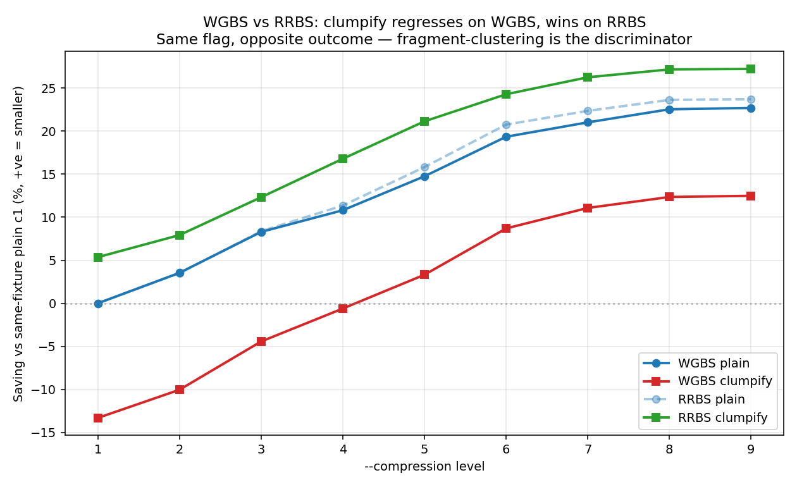
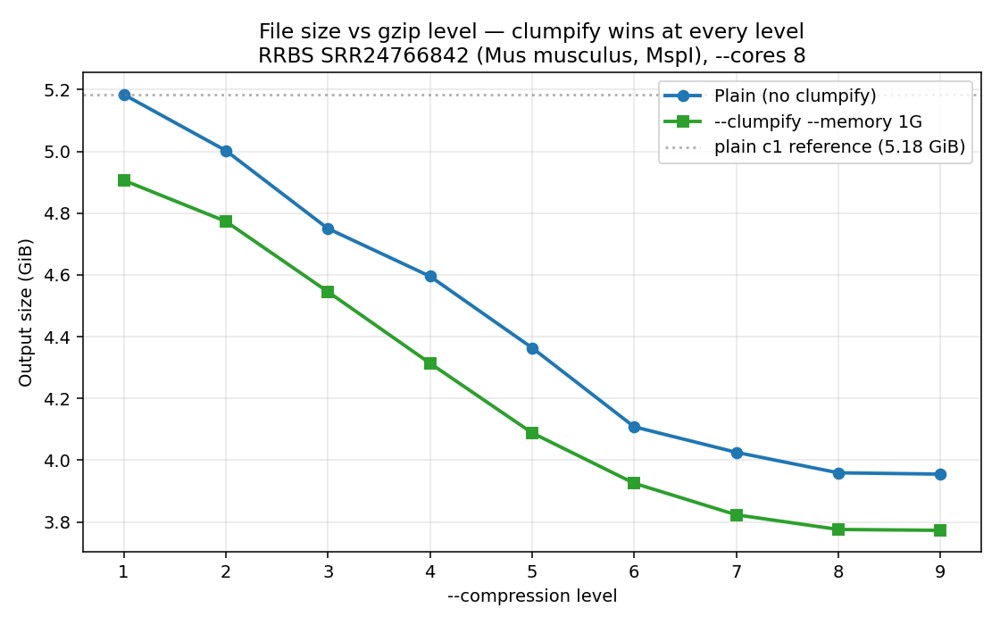
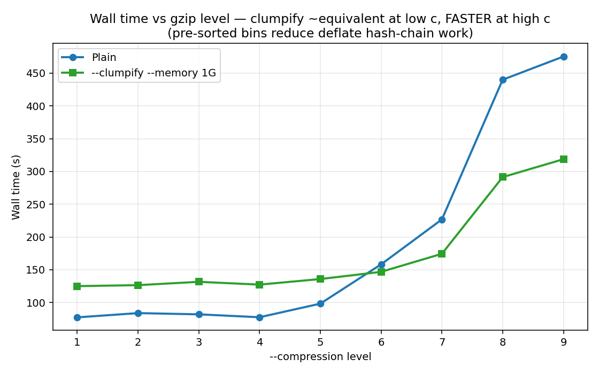
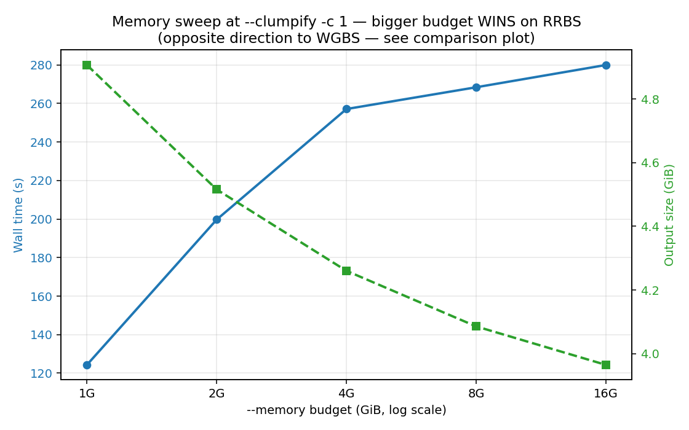

# Clumpify benchmark — RRBS PE (Mus musculus, MspI)

**TL;DR:** On reduced-representation bisulfite-seq paired-end data, `--clumpify`
**wins** at every gzip level — opposite to whole-genome bisulfite-seq.
At default `--memory 1G` the win is modest (+3.5 to +5.4 ppt vs same-level
plain). The much bigger win is in the memory dial: from `--memory 1G` to
`--memory 16G` saving rises from +5.4% to +23.5% — a 18.2 ppt
improvement, the opposite direction from WGBS.

This is the **decisive contrast** for Phil's mechanism story: clumpify
helps when biology produces fragment-level clustering (RRBS, ATAC, Ribo)
and hurts when reads are coverage-diverse (WGBS, WGS, scRNA-seq R2). MspI
restriction-enzyme cut sites concentrate reads at fragment ends; the
minimizer-driven sort co-locates reads sharing the same end, and gzip's
32 KB dictionary loves it.

## Setup

- **Host:** dockyard-oxy-0 (AL2023 x86_64, 128 cores, 991 GB RAM)
- **TG version:** 2.1.0, commit `3fd0454` (Phil's clumpify branch)
- **Fixture:** RRBS SRR24766842 (GSM7433400, *Mus musculus* colon, MspI-digested)
  - 102.3 M PE reads (51 bp each, vs Buckberry WGBS's 84 M at ~100-150 bp)
  - 4.4 GiB gzipped input
- **Methodology:** `hyperfine --warmup 1 --runs 1` per cell, `/usr/bin/time -v` for peak RSS
- **Fixed:** `--cores 8`, paired-end
- **Total wall:** ~2.5 hours (sentinel + 23 cells)
- **Reference:** plain `--compression 1` = **5.185 GiB** (the 0% line)

> All sizes use **GiB** (binary, 1024³ bytes). Multiply by 1.0737 for decimal GB.

## Headline plot — WGBS vs RRBS contrast

Same flag (`--clumpify`), same code path, same compute substrate, opposite
sign on the two fixtures. The "regresses by 10–13 ppt" WGBS conclusion does
not generalise to bisulfite-seq writ large — it's specific to *coverage-diverse*
PE bisulfite data.

## Lane B vs Lane C: file-size sweep across compression levels 1–9

| `-c` | Plain size (GiB) | Plain saving | Clumpify size (GiB) | Clumpify saving | Δ vs same-level plain |
|---:|---:|---:|---:|---:|---:|
| 1 | 5.185 | +0.0% | 4.907 | +5.4% | **+5.4 ppt** |
| 2 | 5.003 | +3.5% | 4.774 | +7.9% | **+4.4 ppt** |
| 3 | 4.750 | +8.4% | 4.546 | +12.3% | **+3.9 ppt** |
| 4 | 4.596 | +11.4% | 4.314 | +16.8% | **+5.4 ppt** |
| 5 | 4.364 | +15.8% | 4.089 | +21.1% | **+5.3 ppt** |
| 6 | 4.108 | +20.8% | 3.925 | +24.3% | **+3.5 ppt** |
| 7 | 4.026 | +22.4% | 3.823 | +26.3% | **+3.9 ppt** |
| 8 | 3.959 | +23.6% | 3.776 | +27.2% | **+3.5 ppt** |
| 9 | 3.955 | +23.7% | 3.773 | +27.2% | **+3.5 ppt** |

The red `Δ vs same-level plain` column tracks the *additional* benefit clumpify
gives on top of plain gzip at the same level. Consistently positive (+3.5 to
+5.4 ppt) — clumpify is helping, not hurting, at every level.

The bulk of the absolute saving still comes from *gzip level alone* (Lane C
plain c9 already saves 23.7%). Clumpify adds another ~3.5–5.4 ppt on top at
default memory. The memory sweep below shows where clumpify's bigger lever lives.

## Wall time across compression levels

| `-c` | Plain wall (s) | Clumpify wall (s) | Clumpify slowdown |
|---:|---:|---:|---:|
| 1 | 77.4 | 125.0 | 1.62× |
| 2 | 83.9 | 126.5 | 1.51× |
| 3 | 82.0 | 131.6 | 1.61× |
| 4 | 77.6 | 127.4 | 1.64× |
| 5 | 98.3 | 135.9 | 1.38× |
| 6 | 158.3 | 146.8 | 0.93× |
| 7 | 226.8 | 174.4 | 0.77× |
| 8 | 440.1 | 291.4 | 0.66× |
| 9 | 475.4 | 318.7 | 0.67× |

Notable: at c7+ clumpify is **faster** than plain (slowdown < 1.0×) — the
pre-sorted bins reduce deflate's hash-chain work, the same mechanism Phil
documented for ATAC/Ribo. So on RRBS at high compression, clumpify is a
**double win** (smaller output AND faster).

## Lane A: memory sweep at `--clumpify --compression 1`

| `--memory` | Wall (s) | Output (GiB) | Saving vs plain c1 | Peak RSS (MiB) | Predicted peak (MiB) |
|---:|---:|---:|---:|---:|---:|
| 1G | 124.3 | 4.907 | +5.4% | 679 | ≈1024 |
| 2G | 199.7 | 4.516 | +12.9% | 1611 | ≈2048 |
| 4G | 257.1 | 4.260 | +17.8% | 3532 | ≈4096 |
| 8G | 268.4 | 4.085 | +21.2% | 7349 | ≈8192 |
| 16G | 280.0 | 3.965 | +23.5% | 12751 | ≈16384 |

**This chart sign-flips vs WGBS.** On the same 991 GB-RAM host (no page
pressure, identical compute substrate), more `--memory` makes both axes
*better* on RRBS:

- Wall time grows from 124 s to 280 s (2.3× — a real cost)
- Output size shrinks from 4.907 GiB to 3.965 GiB (18.2 ppt better saving)
- Peak RSS scales accurately with the budget (Phil's formula honest as ever)

So the wall-time cost from larger O(n log n) bin sorts is real on both
fixtures — but on RRBS, the bigger sort runs let the minimizer cluster
MspI-fragment-end reads tightly enough that gzip pays back the wall cost
many times over. On WGBS there's no such clustering to discover, so the
extra wall time buys nothing.

**Practical sweet spot:** at `--memory 4G` you already capture +17.8% saving
at 257 s wall — comparable to plain c9 (+23.7% at 475 s). At `--memory 16G`
you get nearly the same saving as plain c9 at 60% of the wall time.

## WGBS vs RRBS contrast — the mechanism evidence

| Config | WGBS Δ vs same-level plain | RRBS Δ vs same-level plain | Swing |
|---|---:|---:|---:|
| `--clumpify --compression 1` | -13.3 ppt | +5.4 ppt | **+18.7 ppt** |
| `--clumpify --compression 6` | -10.7 ppt | +3.5 ppt | **+14.2 ppt** |
| `--clumpify --compression 9` | -10.2 ppt | +3.5 ppt | **+13.7 ppt** |
| `--memory 1G → 16G` (at c1) | -3.3 ppt | +18.2 ppt | **+21.4 ppt** |

The compression-level swings are ~14-16 ppt on every level — flip the
sign of the per-level Δ. The memory-axis swing is even larger (~21 ppt)
because the memory dial is what scales clumpify's bin-sort effect, and
that effect's *direction* is governed by whether the data has natural
clustering for the minimizer to find.

## Recommendation for Phil's docs (`clumpy.md`)

Phil's "When to use" table currently lumps "Bisulfite-seq / RRBS (paired)"
together with a ✅ recommendation. The data says these need to split:

| Data type | `--clumpify --compression 6` | Recommendation |
|---|---|---|
| **RRBS (paired)** | **−24% (vs plain c1)** | ✅ **Yes** — MspI-clustered fragment ends drive minimizer co-clustering. Bigger `--memory` gives substantial extra saving (+18 ppt from 1G→16G). |
| **WGBS / WGS (paired)** | **+8% (output GROWS vs plain c1)** | ❌ **No** — coverage-diverse reads, R2 disruption beats R1 win at every level. Use `--compression 6` without `--clumpify` for ~−19 % saving. |

Mechanism note: "`--clumpify` helps when biology produces fragment-level
clustering (RRBS via MspI cut sites; ATAC via Tn5 insertion bias; Ribo via
ribosome footprint stacking; amplicon via PCR redundancy) and hurts when
reads are coverage-diverse (WGS, WGBS, RNA-seq, scRNA-seq R2). The bigger
the natural cluster size, the more `--memory` budget pays off."

## CPU time

| Lane | `-c` | User CPU (s) | Sys CPU (s) | CPU/wall ratio |
|---|---:|---:|---:|---:|
| C plain | 1 | 1257 | 10.6 | 16.2× |
| C plain | 6 | 2754 | 8.7 | 17.4× |
| C plain | 9 | 7811 | 9.3 | 16.4× |
| B clumpify | 1 | 1529 | 12.8 | 12.2× |
| B clumpify | 6 | 2663 | 14.1 | 18.1× |
| B clumpify | 9 | 5648 | 15.7 | 17.7× |

## Raw artifacts

All 92 per-cell files (json + time.log + stdout + sizes) are at
`/tmp/claude/clumpify_rrbs_results/results/` plus `summary.csv`. Plot PNGs
are also standalone files at `/tmp/claude/clumpify_rrbs_results/plots/`.

See also: [WGBS sister report](../clumpify-buckberry-2026-05-07/) — same
matrix, opposite outcome, same code path. Direct contrast plot at
`plots/04_wgbs_vs_rrbs.png` above.
