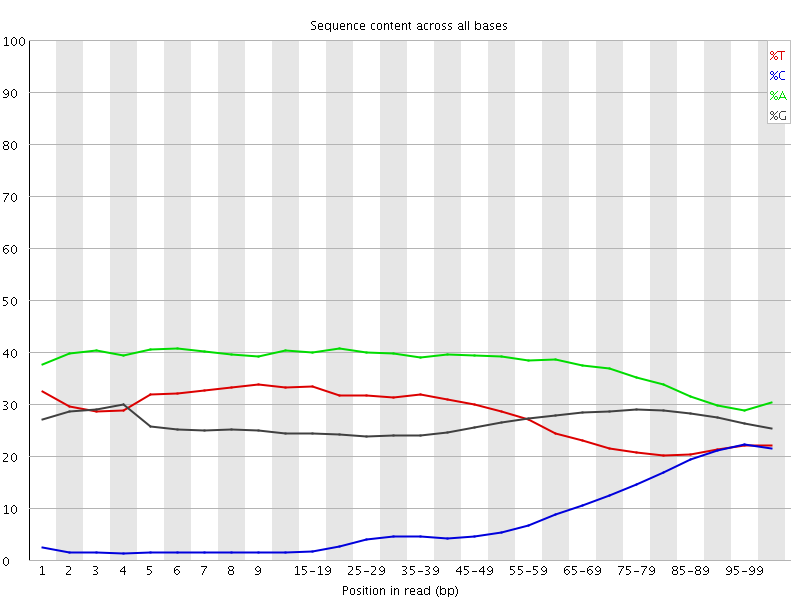
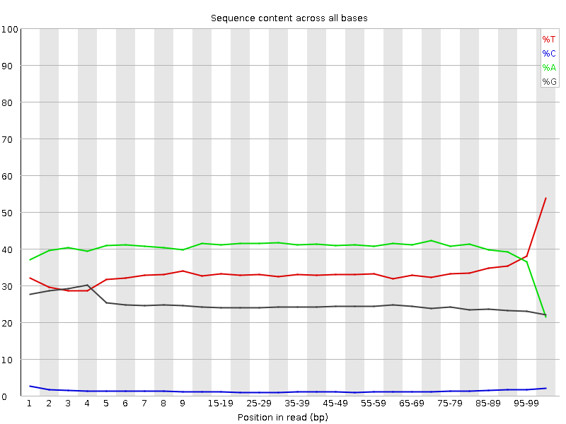

In the next step, Trim Galore finds and removes adapter sequences from the 3' end of reads.

## Adapter auto-detection

If no sequence was supplied, Trim Galore will attempt to auto-detect the adapter that has been used. For this it will analyse the first 1 million sequences of the first specified file and count exact substring matches against a set of standard adapter probes:

```
Illumina:   AGATCGGAAGAGC                     (13 bp)
Small RNA:  TGGAATTCTCGG                      (12 bp)
Nextera:    CTGTCTCTTATA                      (12 bp)
BGI/DNBSEQ: AAGTCGGAGGCCAAGCGGTCTTAGGAAGACAA  (32 bp; v2.x addition)
```

If no adapter contamination can be detected within the first 1 million sequences, or in case of a tie, Trim Galore defaults to `--illumina`. The auto-detection results are shown on screen and printed to the trimming report for future reference.

In v2, auto-detection runs **per pair** rather than once per invocation, so a glob like `trim_galore --paired *fastq.gz` correctly handles multiple samples with different library types or 2-colour/4-colour chemistries.

The Stranded Illumina adapter (`ACTGTCTCTTATA`) is intentionally not auto-detected: it differs from the Nextera adapter by a single A-tail base, so probing both would produce constant ambiguous ties. Pass `--stranded_illumina` explicitly when working with those libraries.

## Multiple adapter sequences

Multiple adapters can be specified in three equivalent ways. The cleanest (v2.x) is simply to repeat `-a` and/or `-a2`:

```bash
trim_galore -a AGCTCCCG -a TTTCATTATAT -a TTTATTCGGATTTAT -n 3 input.fastq.gz
trim_galore --paired -a2 AGCTAGCG -a2 TCTCTTATAT -a2 TTTCGGATTTAT -n 3 R1.fq.gz R2.fq.gz
```

The v0.6.x embedded-string form is still accepted for backwards compatibility:

```bash
trim_galore -a  " AGCTCCCG -a TTTCATTATAT -a TTTATTCGGATTTAT" input.fastq.gz
trim_galore -a2 " AGCTAGCG -a TCTCTTATAT -a TTTCGGATTTAT" --paired R1.fq.gz R2.fq.gz
```

Or load adapters from a FASTA file:

```bash
trim_galore -a "file:./adapters.fa" input.fastq.gz
trim_galore -a "file:./r1_adapters.fa" -a2 "file:./r2_adapters.fa" --paired R1.fq.gz R2.fq.gz
```

For all three forms, adding `-n 3` lets Trim Galore strip up to three adapter occurrences from each read. This is useful when adapter contamination can appear multiple times in the same read. Standard trimming does not require `-n`. More information can be found in [Issue 86](https://github.com/FelixKrueger/TrimGalore/issues/86).

Single-base expansion (`A{10}` to `AAAAAAAAAA`) is also supported for both `-a` and `-a2`, matching Perl v0.6.x syntax.

## Manual adapter sequence specification

The auto-detection behaviour can be overruled by specifying an adapter sequence manually or by using `--illumina`, `--nextera` or `--small_rna`, or `--stranded_illumina` (see `--help` for more details). **Please note**: the first 13 bp of the standard Illumina paired-end adapters (`AGATCGGAAGAGC`) recognise and removes adapter from most standard libraries, including the Illumina TruSeq and Sanger iTag adapters. This sequence is present on both sides of paired-end sequences, and is present in all adapters before the unique Index sequence occurs. So for any 'normal' kind of sequencing you do not need to specify anything but `--illumina`, or better yet just use the auto-detection.

To control the stringency of the adapter removal process one gets to specify the minimum number of required overlap with the adapter sequence; else it will default to 1. This default setting is extremely stringent, i.e. an overlap with the adapter sequence of even a single bp is spotted and removed. This may appear unnecessarily harsh; however, as a reminder adapter contamination may in a Bisulfite-Seq setting lead to mis-alignments and hence incorrect methylation calls, or result in the removal of the sequence as a whole because of too many mismatches in the alignment process.

Tolerating adapter contamination is most likely detrimental to the results, but we realize that this process may in some cases also remove some genuine genomic sequence. It is unlikely that the removed bits of sequence would have been involved in methylation calling anyway (since only the 4th and 5th adapter base would possibly be involved in methylation calls, for directional libraries). However, it is quite likely that true adapter contamination, irrespective of its length, would be detrimental for the alignment or methylation call process, or both.

| Before adapter trimming | After adapter trimming |
|:---:|:---:|
|  |  |

This example (same dataset as above) shows the dramatic effect of adapter contamination on the base composition of the analysed library, e.g. the C content rises from ~1% at the start of reads to around 22% (!) towards the end of reads. Adapter trimming gets rid of most signs of adapter contamination efficiently. Note that the sharp decrease of A at the last position is a result of removing the adapter sequence very stringently, i.e. even a single trailing A at the end is removed.

## Trimming error rate

The default error tolerance for adapter alignment is `-e 0.1` (10%). Lowering this is rarely useful; raising it can recover more contamination at the cost of more false positives.

## Already-trimmed data

`--consider_already_trimmed <INT>` suppresses adapter trimming entirely when no auto-detect probe exceeds that count (quality trimming still runs). Useful for feeding already-trimmed data through Trim Galore for QC reporting without over-trimming.

## Related flags

| Flag | Purpose |
|------|---------|
| `-a SEQ` / `-a2 SEQ` | Adapter for read 1 / read 2 (repeatable in v2). |
| `--illumina` / `--nextera` / `--small_rna` / `--stranded_illumina` | Force a specific known adapter. |
| `--bgiseq` | Use the BGI/DNBSEQ adapter (also probed by auto-detect). |
| `-s INT` / `--stringency INT` | Minimum adapter overlap (default 1 bp). |
| `-e FLOAT` | Maximum error rate for adapter alignment (default 0.1). |
| `-n INT` | Trim up to N adapter occurrences per read (multi-adapter mode). |
| `--consider_already_trimmed INT` | Skip adapter trimming if no adapter exceeds the count threshold. |
