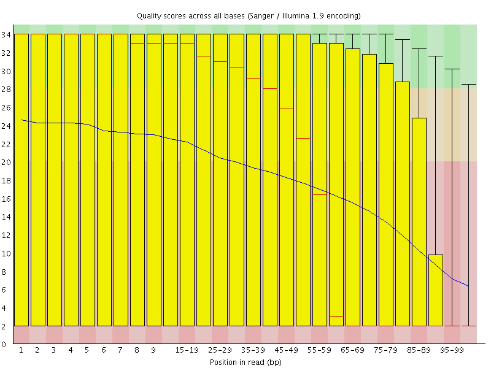
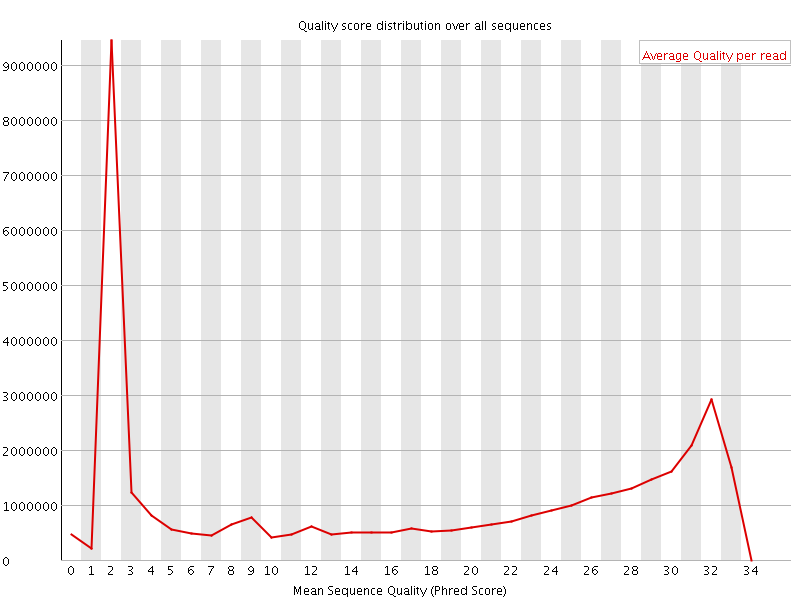
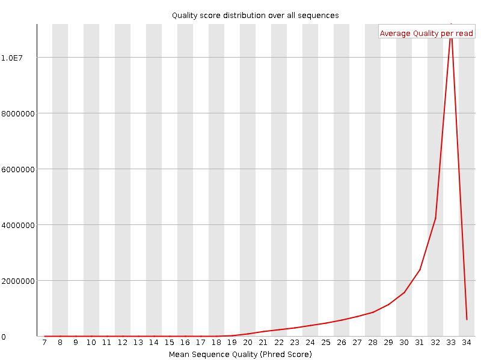

In the first step, low-quality base calls are trimmed off from the 3' end of the reads before adapter removal. This efficiently removes poor quality portions of the reads.

The default Phred-score cutoff is **20** (`-q 20`). Trimming uses the BWA algorithm: the running sum of `(Q - cutoff)` is computed from the 3' end, and bases are removed up to the position with the maximum cumulative score.

## Example: before and after

The plots below show a public dataset (DRR001650_1, Kobayashi et al., 2012) before and after trimming with `-q 20`.

| Before quality trimming | After quality trimming |
|:---:|:---:|
|  |  |
|  |  |

## 2-colour instrument quality trimming

Default `-q` quality trimming was designed for 4-colour Illumina chemistry (HiSeq, MiSeq). On 2-colour instruments (NextSeq, NovaSeq, NovaSeq X), no signal is encoded as **G**, which leads to spurious high-quality G-runs at the 3' end of reads with little signal. Pass `--2colour N` (or its alias `--nextseq N`) to use 2-colour-aware quality trimming, which treats trailing Gs as low-quality before applying the Phred cutoff.

```bash
trim_galore --2colour 20 input.fastq.gz
```

`--2colour` and `--nextseq` are opt-in. They **replace** `-q`. They are independent of `--poly_g`, which is sequence-based and runs after quality trimming.

## Phred encoding

Trim Galore defaults to Phred+33 encoding (Sanger / standard Illumina 1.8+). For very old data in Phred+64, pass `--phred64`.

## What's logged

The chosen cutoff and encoding are recorded in the trimming report:

```
Quality Phred score cutoff: 20
Quality encoding type selected: ASCII+33
```

The Cutadapt-compatible block in the same report shows the total bases trimmed by quality.

## Related flags

- `-q INT`. Phred quality cutoff (default 20).
- `--phred33` / `--phred64`. Phred encoding (default Phred+33).
- `--2colour N` / `--nextseq N`. Opt-in 2-colour-aware trimming, replaces `-q`.
