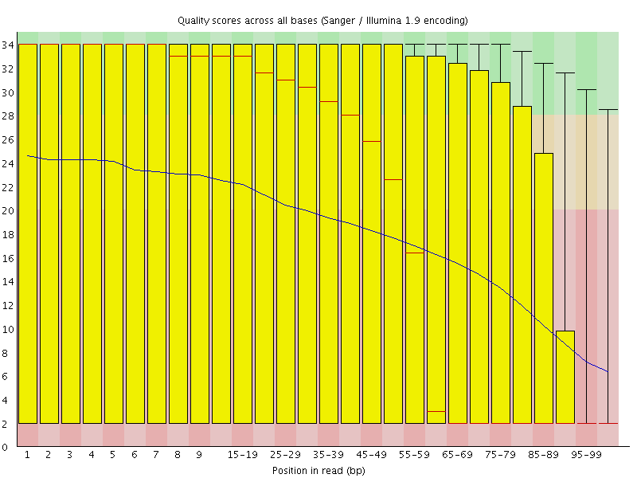
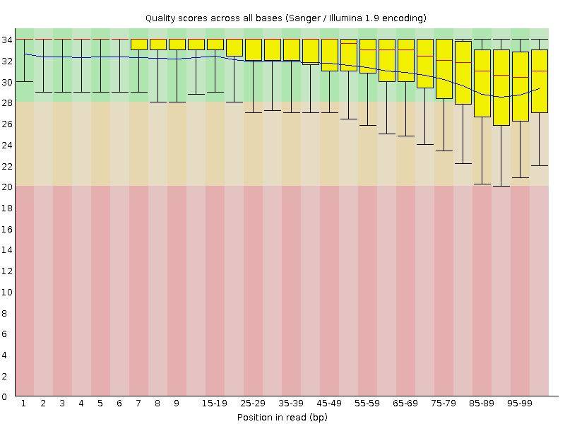
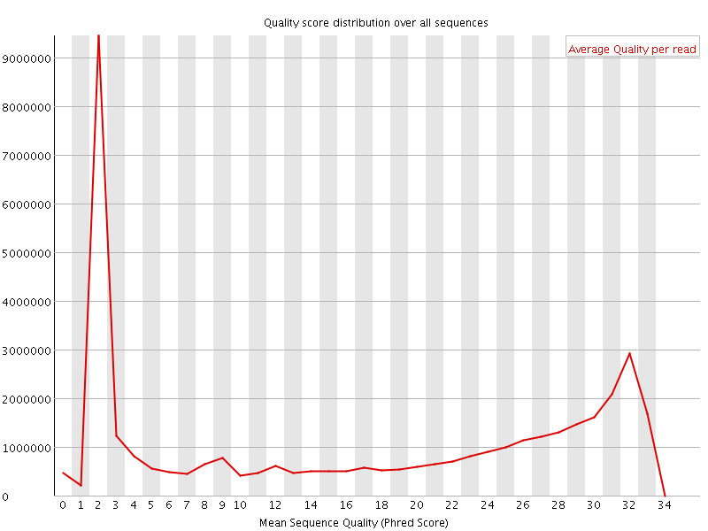
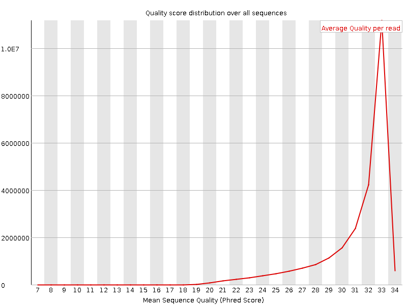

In the first step, low-quality base calls are trimmed off from the 3' end of the reads before adapter removal. This efficiently removes poor quality portions of the reads.

The default Phred-score cutoff is **20** (`-q 20`). Trimming uses the BWA algorithm: the running sum of `(cutoff - Q)` is computed from the 3' end, and bases are removed up to the position with the maximum cumulative score.

## Example: before and after

The plots below show a public dataset (DRR001650_1, Kobayashi et al., 2012) before and after trimming with `-q 20`.

| Before quality trimming | After quality trimming |
|:---:|:---:|
|  |  |
|  |  |

## 2-colour instrument quality trimming

Default `-q` quality trimming was designed for 4-colour Illumina chemistry (HiSeq, MiSeq). On 2-colour instruments (NextSeq, NovaSeq, NovaSeq X), no signal is encoded as **G**, which leads to spurious high-quality G-runs at the 3' end of reads with little signal. Pass `--2colour N` (or its alias `--nextseq N`) to use 2-colour-aware quality trimming, which treats trailing Gs as low-quality before applying the Phred cutoff.

```bash
trim_galore --2colour 20 input.fastq.gz
```

`--2colour` and `--nextseq` are opt-in. They **replace** `-q`. They are independent of `--poly_g`, which is sequence-based and runs after quality trimming.

## Phred encoding

Trim Galore defaults to Phred+33 encoding (Sanger / standard Illumina 1.8+). For very old data in Phred+64, pass `--phred64`.

`--phred64` describes the encoding of the **input**. FASTQ-to-FASTQ runs preserve it, so Phred+64 in gives Phred+64 out. A round trip through unaligned BAM does not: the BAM boundary stores raw Phred scores and discards the ASCII encoding by design, so `Phred+64 → uBAM → FASTQ` emits Phred+33. That is correct behaviour, not data loss — the scores are unchanged, only their textual representation differs.

The flag applies to FASTQ input only, and is **rejected for unaligned BAM input**. BAM stores raw Phred scores directly rather than ASCII-offset characters, so there is no encoding to declare — the reader always yields Phred+33 internally. Passing `--phred64` alongside a `.bam` input therefore has no correct interpretation. Before it was rejected, a run with quality trimming (`-q > 0`) discarded effectively the whole library as low-quality, while `--hardtrim5/3` and `--clump_only` ignored the flag entirely. Drop it for BAM input: those modes' output is unchanged, and a trimming run now produces the result it should have produced all along.

With `--output-format ubam`, `--phred64` is honoured for FASTQ input: the output BAM's `QUAL` field stores true Phred scores (0–93) as the SAM specification requires, not the input's ASCII bytes. Note that the trimming report's `Quality encoding type selected: ASCII+64` line describes the input, not the BAM.

:::caution
Confirm the input encoding before using `--phred64` — Phred+64 was retired with Illumina 1.8 (2011). Running Phred+33 data with the flag reduces every score by 31 and floors at zero, so a typical Q2–Q41 range becomes Q0–Q10. The result looks like plausible poor-quality data rather than obviously empty output, which makes it easy to miss; Trim Galore prints a `NOTE:` when `--phred64` is combined with uBAM output for that reason.
:::

## What's logged

The chosen cutoff and encoding are recorded in the trimming report:

```
Quality Phred score cutoff: 20
Quality encoding type selected: ASCII+33
```

The Cutadapt-compatible block in the same report shows the total bases trimmed by quality.

## Related flags

- `-q INT`. Phred quality cutoff (default 20).
- `--phred33` / `--phred64`. Phred encoding (default Phred+33).
- `--2colour N` / `--nextseq N`. Opt-in 2-colour-aware trimming, replaces `-q`.
