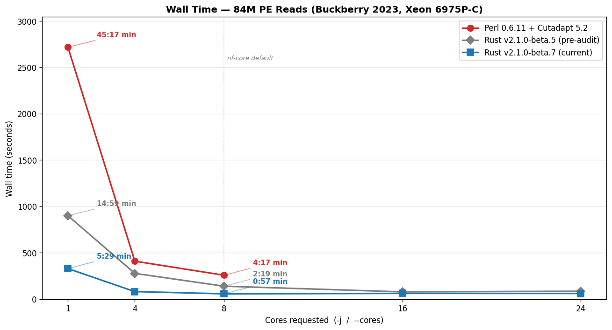
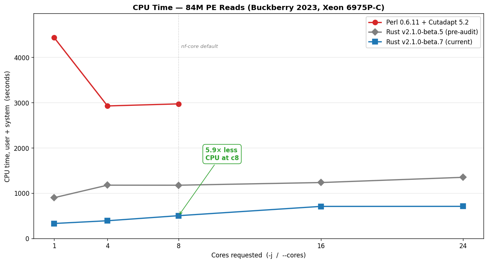

## Test dataset

84M paired-end reads — Buckberry et al. 2023 [`SRR24827373`](https://www.ncbi.nlm.nih.gov/sra/?term=SRR24827373) (whole-genome bisulfite sequencing, ~4.4 GiB gzipped, R1 + R2 combined). Outputs verified byte-identical (decompressed) between Rust beta.5 and beta.7 across all core counts via md5 checksums — Myers' prefilter is byte-identity-preserving by construction.

## At a glance

Charts regenerate from `~/perf_data/2026-04-29/*.json` via `python3 docs/scripts/generate-benchmark-charts.py --data <dir> --out docs/src/assets/benchmarks/`. Re-run as additional matrix points (Perl c8/c16, Rust extras c10/12/14) land.

## Server benchmark: Intel Xeon 6975P-C (dockyard-oxy-0)

Tested with `hyperfine --warmup 1 --runs 10` per condition. CPU time is user + system summed across all OS threads (i.e., what cluster billing dashboards report).

### Trim Galore v0.6.11 (Perl 5 + Cutadapt 5.2 + igzip + pigz)

| `-j` | Wall time | CPU time |
|-----:|----------:|---------:|
| 1 | 45:17 (2,717s) | 4,437s |
| 4 | 6:49 (409s) | 2,927s |
| 8 | 4:17 (257s) | 2,972s |
| 16 | **{TBD: ETA ~10:30 UTC}** | **{TBD}** |

### Trim Galore v2.1.0-beta.5 (Rust, pre-Buckberry-audit baseline)

This is the "v2.0-era" Rust binary — published to crates.io before the post-audit optimizations landed. It's the right reference for **what shipped before the Buckberry-scale audit drove the next round of perf wins**.

| `--cores` | Wall time | CPU time |
|----------:|----------:|---------:|
| 1 | 14:59 (899s) | 899s |
| 4 | 4:37 (277s) | 1,176s |
| 8 | 2:19 (139s) | 1,175s |
| 10 | **{TBD: extras, ETA ~11:00 UTC}** | **{TBD}** |
| 12 | **{TBD: extras}** | **{TBD}** |
| 14 | **{TBD: extras}** | **{TBD}** |
| 16 | 1:18 (78s) | 1,233s |
| 24 | 1:25 (85s) | 1,349s |

### Trim Galore v2.1.0-beta.7 (Rust, post-Myers' prefilter — current)

Includes three optimizations from the Buckberry-scale audit (co-authored with [@an-altosian](https://github.com/an-altosian)):
1. **Output gzip level 6 → 1** (beta.6) — sheds compression CPU at saturation; ~75% larger output bytes traded for ~2× faster trimming on multi-core runs.
2. **Single buffered write per `FastqRecord`** (beta.6) — collapsed 4× `writeln!` into one `write_all`.
3. **Myers' bit-parallel adapter alignment prefilter** (beta.7) — short-circuits the scalar DP when no match within the error budget is possible. Conservative wrapper, byte-identity-preserving by construction.

| `--cores` | Wall time | CPU time | vs beta.5 wall | vs beta.5 CPU |
|----------:|----------:|---------:|---------------:|--------------:|
| 1 | 5:29 (329s) | 329s | **2.74× faster** | **2.73× less** |
| 4 | 1:21 (81s) | 389s | **3.43× faster** | **3.02× less** |
| 8 | **0:57 (57s)** | **501s** | **2.46× faster** | **2.34× less** |
| 10 | **{TBD}** | **{TBD}** | — | — |
| 12 | **{TBD}** | **{TBD}** | — | — |
| 14 | **{TBD}** | **{TBD}** | — | — |
| 16 | 1:01 (61s) | 706s | 1.27× faster | 1.75× less |
| 24 | 1:01 (61s) | 707s | 1.40× faster | 1.91× less |

### Version-to-version: post-audit wall-time wins

Combined wall-time improvements at the headline core counts on Buckberry:

| `--cores` | beta.5 wall | beta.7 wall | **Wall reduction** |
|----------:|------------:|------------:|-------------------:|
| 1 | 899s | 329s | **−63.4%** |
| 4 | 277s | 81s | **−70.8%** |
| 8 | 139s | 57s | **−59.3%** |

Both versions saturate around `--cores 8` (beta.7) / `--cores 16` (beta.5) on this fixture; beyond that, gzip-output I/O on the disk overlay is the bottleneck. The c10/c12/c14 ladder rungs (filling in between c8 and c16) will sharpen the saturation-point picture when they land later this morning.

### Head-to-head: Perl 0.6.11 vs Rust v2.1.0-beta.7

| Cores | Perl wall | Rust wall | **Wall speedup** | Perl CPU | Rust CPU | **CPU savings** |
|------:|----------:|----------:|-----------------:|---------:|---------:|----------------:|
| 1 | 2,717s | 329s | **8.26×** | 4,437s | 329s | **13.49×** |
| 4 | 409s | 81s | **5.06×** | 2,927s | 389s | **7.52×** |
| 8 | 257s | 57s | **4.54×** | 2,972s | 501s | **5.93×** |
| 16 | **{TBD}** | 61s | **{TBD}** | **{TBD}** | 706s | **{TBD}** |

### Production comparison: nf-core default (`--cores 8`)

In nf-core pipelines, Trim Galore is typically allocated 12 CPUs (`process_high`) and run with `-j 8` (the module subtracts 4 for overhead). With `-j 8`, TG spawns up to ~27 threads across Cutadapt workers, pigz compression, and pigz/igzip decompression. nf-core installs TG from bioconda, which includes igzip (Intel ISA-L) for decompression.

| | TG `-j 8` | Oxidized `--cores 4` | Oxidized `--cores 8` | Oxidized `--cores 24` |
|---|---|---|---|---|
| **Wall time** | 257s | 81s (3.17× faster) | **57s (4.54× faster)** | 61s (4.21× faster) |
| **CPU time** | 2,972s | 389s (7.64× less) | **501s (5.93× less)** | 707s (4.20× less) |
| **Threads** | up to ~27 | 8 (deterministic) | 12 (deterministic) | 28 (deterministic) |

Three ways to read this:

- **Smallest CPU footprint:** Oxidized `--cores 4` (8 threads, 389s CPU) already finishes **3.17× faster than TG `-j 8`** while using **7.64× less CPU**. Best choice when CPU/cluster-hours are the constraint.
- **Headline speed at saturation:** Oxidized `--cores 8` (12 threads) finishes in **57 seconds — 4.54× faster than TG `-j 8`** at **5.93× less CPU**. The cleanest apples-to-apples cores-vs-cores comparison; this is the number nf-core users see.
- **Maximum throughput at comparable thread budget:** Oxidized `--cores 24` (~28 threads) vs TG `-j 8` (~27 threads). Finishes in 61 seconds, **4.21× faster** at 4.20× less CPU. Diminishing returns past `--cores 8` because gzip-output I/O is the bottleneck.

## Laptop benchmark: Apple M1 Pro (10 cores)

(Older benchmark from a different 56M-read fixture (SRR24827378), preserved for laptop-class hardware reference. The Rust binary used here is v2.0-era — pre-Buckberry-audit. A v2.1.0-beta.7 re-run on Apple Silicon would land slightly larger speedups, comparable to the server-side picture above.)

### Trim Galore (Perl 5.34 + Cutadapt 4.9 + pigz)

| `-j` | Wall time | CPU time |
|-----:|----------:|---------:|
| 1 | 27:04 (1,624s) | 2,536s |
| 2 | 13:50 (830s) | 2,741s |
| 4 | 7:15 (435s) | 2,868s |

### Trim Galore Oxidized Edition (v2.0-era Rust)

| `--cores` | Wall time | CPU time | Speedup vs TG `-j 1` |
|----------:|----------:|---------:|----------------------:|
| 1 | 11:46 (706s) | 695s | 2.3× |
| 2 | 7:16 (436s) | 908s | 3.7× |
| 4 | 3:46 (226s) | 936s | 7.2× |
| 6 | 2:35 (155s) | 957s | 10.5× |
| 8 | 2:03 (123s) | 994s | 13.2× |

## Cost and CO₂

CPU time is what cloud providers bill for and what drives energy consumption. Trim Galore v2.1.0-beta.7 uses **5.9× to 13.5× less CPU time** than Perl Trim Galore for the same job, depending on the core count:

| Scenario | Perl CPU time | Rust v2.1.0-beta.7 CPU time | **CPU savings** |
|---|---|---|---|
| Single-threaded | 4,437s | 329s | **13.49×** |
| 8 cores (nf-core default) | 2,972s | 501s | **5.93×** |

On AWS at ~$0.05/vCPU-hour, trimming 84M PE reads at the nf-core default costs roughly **$0.041 with TG** vs **$0.007 with Oxidized** — a 5.9× saving per sample. Across a 1000-sample cohort that scales to **~$41 with TG vs ~$7 with Oxidized**, with proportional savings in carbon footprint and shared-cluster CPU-hour pressure.

## Methodology

- **Timing:** All wall time and CPU time measured via `hyperfine --warmup 1 --runs 10` per condition. CPU time = user + system, summed across all OS threads. JSON exports preserved at `~/perf_data/2026-04-29/` on the benchmarking host.
- **Reproducer:** [`scripts/benchmark.sh`](https://github.com/FelixKrueger/TrimGalore/blob/optimus_prime/scripts/benchmark.sh) on the `optimus_prime` branch — drives the full matrix (Rust beta.5/beta.7 at cores 1/4/8/10/12/14/16/24; Perl 0.6.11 + Cutadapt 5.2 at cores 1/4/8/16) with `hyperfine --warmup 1 --runs 10`. Includes a cross-version byte-identity check at the end (beta.5 vs beta.7 cores=8 outputs).
- **Thread counts (TG):** Approximate peak values from architectural reasoning (Cutadapt workers + pigz compression workers + igzip/pigz decompression). Threads are spawned across three independent subprocesses whose lifetimes may not fully overlap.
- **Thread counts (Oxidized):** Deterministic from the architecture: exactly N+4 threads for `--cores N` (N workers + 2 decompressors + 1 batcher + 1 writer), or exactly 1 thread for `--cores 1`.
- **igzip:** The bioconda Trim Galore installation includes igzip (Intel ISA-L) for fast single-threaded decompression. Benchmarks run with igzip available to match the nf-core production environment.
- **Outputs verified:** All Rust beta.5 and beta.7 outputs were confirmed byte-identical (decompressed) at `--cores 8` via md5 checksums. Myers' prefilter is byte-identity-preserving by construction.

For the architectural reasons behind the numbers (single-pass vs three-pass architecture, worker-pool parallelism, thread-budget breakdown), see [Threading model](/TrimGalore/performance/threading/).
