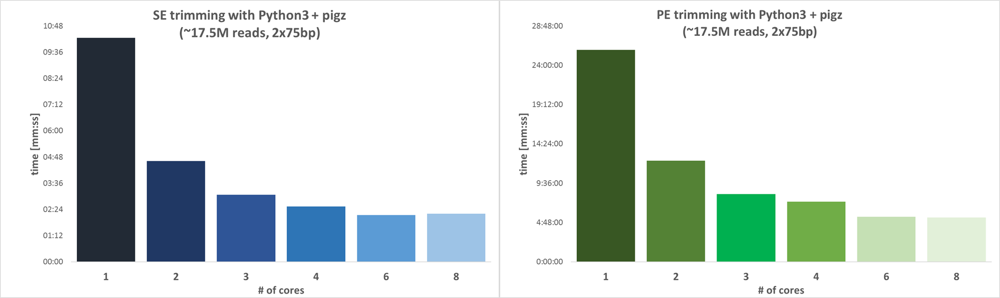

:::note
The canonical source for the changelog lives at [`CHANGELOG.md`](https://github.com/FelixKrueger/TrimGalore/blob/master/CHANGELOG.md) in the repo root. The version below is a copy synced with the docs.
:::


### Version 2.1.0-beta.5 (Release on 27 Apr 2026)

#### Bug fixes (since v2.1.0-beta.4)
- **Bundled FastQC: percentage precision in `>>Overrepresented sequences`.**
  Bumps `fastqc-rust` dep from v1.0.0 to v1.0.1, which restores Java
  FastQC 0.12.1 byte-identity in that section. v1.0.0 rounded the
  percentage column to 2 decimals (`7.16`) instead of emitting Java's
  full `Double.toString()` precision (`7.160449112640348`). Detected
  during the `nf-core/rnaseq#1789` integration matrix on NF 25.04.3,
  where the older pinned MultiQC preserves the literal percentage
  string when aggregating into `fastqc_trimmed_overrepresented_sequences_plot.txt`,
  so the truncated value cascaded into a downstream MD5 mismatch. Fix
  filed and merged upstream as
  [ewels/FastQC-Rust#2](https://github.com/ewels/FastQC-Rust/pull/2).
  Detected sequences, counts, and source classification were always
  correct, this was a cosmetic formatting deviation, not a scientific one.


### Version 2.1.0-beta.4 (Release on 26 Apr 2026)

#### New features (since v2.1.0-beta.3)
- **Bundled FastQC.** `--fastqc` now uses the
  [fastqc-rust](https://crates.io/crates/fastqc-rust) library directly
  instead of shelling out to an external `fastqc` binary. Removes Java
  and the FastQC tarball as runtime dependencies, completing the
  "single static binary, zero external runtime deps" story for v2.x.
  Output files (`*_fastqc.html`, `*_fastqc.zip`) are FastQC 0.12.1-
  compatible (the same version we previously bundled in the Docker
  image), so MultiQC parsers and downstream pipelines see identical
  structure. The Docker image is correspondingly slimmer (no
  `default-jre-headless`, no `perl`, no FastQC tarball; saves
  approximately 350 MB at the runtime layer). (#226)
  - `--fastqc_args` continues to accept the common subset (`--nogroup`,
    `--expgroup`, `--quiet`, `--svg`, `--nano`, `--nofilter`,
    `--casava`, `-t`/`--threads`, `-o`/`--outdir`); other flags emit a
    warning and are ignored, forward-compat with future fastqc-rust
    additions.
  - `--help` text for `--fastqc` and `--fastqc_args` refreshed to
    describe the bundled integration and enumerate the translated flag
    set; `docs/SUMMARY.md` architecture-shift paragraph and parity
    table updated accordingly. (#227)

#### Bug fixes (since v2.1.0-beta.3)
- `--clock` and `--implicon` now accept multi-pair input (an even
  number of files as consecutive R1/R2 pairs), restoring v0.6.x
  semantics that the v2.x rewrite had narrowed to "exactly 2 input
  files". Same widening as the `--paired` fix in beta.2; the two
  specialty run-and-exit modes had their own validation that wasn't
  updated at the time. Each pair gets a per-pair header
  (`=== Clock pair N of M ===` / `=== IMPLICON pair N of M ===`) and
  the same output-collision pre-flight (case-insensitive on full path)
  that `--paired` runs. (#224)

#### Infrastructure (contributor-facing)
- `rust-version` bumped from 1.85 → 1.88 (required by fastqc-rust).
- `.gitattributes` added so the GitHub repo language bar reflects the
  actual Rust content rather than HTML in `docs/`. (#225, contributed
  by @ewels)


### Version 2.1.0-beta.3 (Release on 24 Apr 2026)

#### New features (since v2.1.0-beta.2)
- **BGI/DNBSEQ added to adapter auto-detection.** Users running
  BGI/MGI/DNBSEQ data no longer need to pass `--bgiseq` explicitly; the
  32 bp BGI adapter is now probed alongside Illumina, Nextera, and
  smallRNA on the first 1 M reads. Stranded Illumina stays
  explicit-only (`--stranded_illumina`) because its sequence differs
  from Nextera by a single A-tail base and would produce constant
  ambiguous ties if probed. Tie-break semantics unchanged. The
  zero-count fallback is still Illumina.
- **Repeatable `-a` / `-a2` multi-adapter syntax.** `-a SEQ1 -a SEQ2`
  now works directly, with no need for the v0.6.x embedded-string
  (`-a " SEQ -a SEQ"`) or FASTA file workaround. Embedded-string and
  `file:adapters.fa` forms still work and can be mixed with repeated
  flags in a single invocation (e.g. `-a " SEQ1 -a SEQ2" -a SEQ3`).
- **Perl-style `A{N}` single-base expansion** for `-a` / `-a2`, e.g.
  `-a A{10}` expands to `-a AAAAAAAAAA`, matching Perl v0.6.x syntax.
  Only applied to the single-adapter case (not to multi-adapter or
  FASTA entries), mirroring Perl behaviour.
- **Perl-era `-r1` / `-r2` / `-a2` short-flag forms are accepted.**
  Clap's single-character short-flag rule meant `-r1 40` previously
  parsed as `-r=1` with `40` becoming a stray positional (producing
  a confusing "odd count" error). A small pre-parse hook now
  transparently rewrites the exact tokens `-r1`, `-r2`, `-a2` (and
  their `=VALUE` variants) to the existing `--r1`, `--r2`, `--a2`
  long-alias forms so Perl-era scripts keep working.

#### Bug fixes (since v2.1.0-beta.2)
- `--trim-n` is now suppressed under `--rrbs`, restoring Perl v0.6.x
  byte-identical output for users who combine both flags. Perl's RRBS
  code path omitted `$trim_n` from its Cutadapt invocations; beta.2
  was applying N-trimming unconditionally, which narrowly violated the
  byte-identity guarantee for that specific flag combination.
- The paired-end parameter-summary line in the text trimming report
  previously emitted a stray `-end` suffix
  (`...before a sequence pair gets removed-end: 20 bp`). Now correctly
  emits `...before a sequence pair gets removed: 20 bp`. Single-end
  output (`...length single-end: 20 bp`) is unchanged.

#### Documentation
- **Flag-by-flag help-text polish (#221).** 25 docstring edits across
  `src/cli.rs`. Most notable: `--paired` no longer claims "exactly 2
  input files" (the multi-pair fix from beta.2 made this stale);
  `--rrbs` help now warns against Tecan Ovation kit incompatibility;
  `--small_rna` surfaces its length auto-lowering side-effect;
  `--bgiseq` notes it is also probed by auto-detection.
- **Positioning reframed from "byte-identical" to "faithful rewrite
  with useful additions" (#222).** The original framing no longer held
  given new capabilities (poly-G handling, generic poly-A trimmer,
  per-pair adapter detection, the above BGI auto-detect, etc.).
  Updated in README, SUMMARY, User Guide, CHANGELOG, and the
  `--help` preamble. Benchmarks' "byte-identical across core counts"
  claims (which are about `--cores` determinism, not Perl equivalence)
  are retained where accurate.
- **User guide refreshed (#223).** 534 → 325 lines. Dropped a ~220-line
  duplicate of `--help` that had been drifting out of sync on every
  polish cut; replaced with a curated "Flag reference" section on
  cross-flag interactions, RRBS-specific guidance (Tecan, MseI), and
  adapter-specification recap. Added IMPLICON coverage (missing from
  the original guide). Modernised the intro/framing, removed the
  floating Babraham logo (project now maintained solo outside
  Babraham), dropped the hand-maintained "Last update" line, and
  renamed the `Version 0.6.11` section heading to `Introduction`.
  Historical attribution preserved as a footer credit.

#### Infrastructure
- Test count grew from **106 → 147** across the beta.2→beta.3 window.
  New coverage: multi-pair validation branches, specialty modes
  (`--clock`, `--implicon` end-to-end), adapter brace expansion,
  four-probe auto-detection set, Perl-era flag rewriting,
  `--trim-n`/`--rrbs` interaction, `parse_adapter_specs` mixed-form
  path.


### Version 2.1.0-beta.2 (Release on 20 Apr 2026)

#### New features (since v2.1.0-beta.1)
- `--version` now prints build provenance on a second line: `<git-hash> — <target>
  — built <ISO-8601 UTC timestamp>`. The short form `-V` remains unchanged (one
  line, matches the original terse format). Useful for bug reports: users can
  paste `trim_galore --version` to pinpoint the exact build.
- Builds are now **reproducible**: setting `SOURCE_DATE_EPOCH` to a fixed Unix
  timestamp (Debian reproducible-builds spec) produces a bit-identical binary
  across runs. Unset, the build stamps the current wall-clock time as before.
  Malformed values hard-fail the build rather than silently falling back.

#### Infrastructure (contributor-facing, no runtime effect)
- New CI gates on every PR: `cargo fmt --check` + `cargo clippy -D warnings`
  (lint), a dedicated reproducibility job that builds the release binary twice
  under a fixed `SOURCE_DATE_EPOCH` and asserts bit-identity, and a weekly
  `rustsec/audit-check` for dependency advisories.
- Dependabot enabled for cargo + github-actions ecosystems (weekly, Monday,
  limit 5, routed to `@FelixKrueger`).

#### Bug fixes (since v2.1.0-beta.1)
- `--paired` now accepts any even number of input files and processes them as
  consecutive R1/R2 pairs, restoring v0.6.x Perl behaviour. Beta 1 rejected
  more than 2 files with "Paired-end mode requires exactly 2 input files".
  Common shell-glob invocations like `trim_galore --paired *fastq.gz` now
  work again. Adapter auto-detection and poly-G scanning run **per pair**
  (intentional deviation from Perl v0.6.x, which detected once on the first
  input file). This is safer for shell-glob invocations that mix library
  types or 2-colour/4-colour chemistries across samples, at negligible cost
  (header-only peek, dominated by FASTQ I/O). The paired-end loop is now
  symmetrical with the single-end loop, which has always detected per file.
- Paired-end validation catches when R1 and R2 are the exact same filename
  (byte-equal path comparison; does not follow symlinks or canonicalise.
  Matches v0.6.x behaviour).
- Paired-end invocations pre-flight-check for output-path collisions across
  pairs and abort before writing rather than silently overwriting. Comparison
  is case-insensitive (ASCII) so filenames differing only in letter-case are
  caught on APFS/NTFS (macOS/Windows default) as well as ext4 (Linux). Fixes
  issue #216.
  - On opt-in case-sensitive APFS/ZFS volumes, filenames differing only in
    letter-case are legitimately distinct; the pre-flight will still reject
    them. Use distinct base names or `--basename` per sample to work around
    this.
  - On partial failure at pair K, pairs 1..K&#8722;1 retain their complete
    outputs on disk and pair K may have a partial output file; pairs
    K+1..N are not attempted. Inspect and re-run only the failing pair.
    Matches v0.6.x Perl behaviour (no rollback across pairs).


### Version 2.1.0 (Beta, Release on 18 Apr 2026)

**Major release: Rust rewrite (Oxidized Edition).** Faithful Rust rewrite of Trim Galore, delivered as a single binary with zero external dependencies and designed as a drop-in replacement for v0.6.x workflows. Outputs match v0.6.x for the core feature set; new capabilities beyond the Perl version include poly-G auto-detection and trimming, a generic poly-A trimmer, per-pair adapter auto-detection, cleaner multi-adapter invocation, a JSON MultiQC-native report, and other extensions. Built from `src/main.rs` (Cargo crate at repo root); the historical Perl script will be preserved at `legacy/trim_galore` once v2.1.0 GA ships (retained in the `0.6.11` tag during the beta window).

**Note on v2.0.0:** v2.0.0 was a pre-release cut inadvertently published to crates.io on 13 Apr 2026. It will be yanked when v2.1.0 GA ships. Users should install v2.1.0 or later.

#### Features (since v2.0.0)
- Multi-adapter support for both R1 and R2 via repeated `-a`/`-a2` flags and `file:adapters.fa` (c36b7fe)
- `--discard-untrimmed` flag (b0db3db)
- Multi-file single-end input (b0db3db)
- JSON trimming report for MultiQC native parsing (efedb95)
- MultiQC-compatible Cutadapt section in text trimming reports (121b821)

#### Bug fixes (since v2.0.0)
- Parallel-path `total_bp_after_trim` and `r2_clipped_5prime` stats now tracked correctly (82d1e34, 3996fc5)
- Cutadapt-section report values match v0.6.x MultiQC-parsed values (eedbc66)
- `--fastqc_args` accepts hyphenated values like `--nogroup` (def0344)
- Multi-member gzip FASTQ files decode correctly (9dcf519)
- Adapter auto-detection scans exactly 1M reads (9129650)

### Version 0.6.11 (Release on 24 Feb 2026)

- Added option `--rename` to write clipped bases to the read ID. Works in all modes with options `--clip_(r1/r2)` and `--three_prime_clip_(r1/r2)`, as well as `--hardtrim5` and `--hardtrim3`. Requested in [this issue](https://github.com/FelixKrueger/TrimGalore/issues/166).

- Added option `--bgiseq` to trim BGISEQ/DNBSEQ/MGISEQ adapters instead of the default auto-detection. Uses `AAGTCGGAGGCCAAGCGGTCTTAGGAAGACAA` for Read 1 (BGI/MGI forward), and
 `AAGTCGGATCGTAGCCATGTCGTTCTGTGAGCCAAGGAGTTG` for Read 2 (BGI/MGI reverse). Requested in [issue#196](https://github.com/FelixKrueger/TrimGalore/issues/196)

- Added option  `--demux <barcode_file>` to demultiplex files from a 3'-end barcode after trimming is completed. Requested in [#199](https://github.com/FelixKrueger/TrimGalore/issues/199)

- Added option `--cutadapt_args "<ARGS>"` to pass extra arguments to Cutadapt, enabling use of advanced Cutadapt options without modifying Trim Galore.

- Changed `--clock` Epigenetic Clock processing behaviour for the 5' end of Read 2.

- Fixed `--demux` handling of CR (carriage return) characters in barcode files; fixed barcode length issue with NoCode; added barcode description to demux summary output.

- Fixed RRBS-specific trimming being silently bypassed when `--nextseq` and `--rrbs` are used together ([#210](https://github.com/FelixKrueger/TrimGalore/issues/210)).

### Version 0.6.10 (Release on 02 Feb 2023)

- Fixed a missing default value of `gzip` as the default decompression path (see [here](https://github.com/FelixKrueger/TrimGalore/commit/a3c6a64ae71657f1a282e01134293e424177a7d5)).

### Version 0.6.9 (Release on 29 Jan 2023)

- Fixed a declaration bug for `maxn_fraction` which had crept in during merging of different branches (see [here](https://github.com/FelixKrueger/TrimGalore/commit/cf9a9d97b723d3829dd902f1229d9c9b7cff8ba0)).

### Version 0.6.8 (Release on 28 Jan 2023)

- Added new option `--stranded_illumina` to allow trimming of the adapter sequence `ACTGTCTCTTATA` (whick looks like the Nextera sequence but with an additional A from A-tailing). See also here: https://github.com/FelixKrueger/TrimGalore/issues/127.

- Trim Galore will now preferentially use `igzip` for decompression, if installed. [More info here](https://github.com/FelixKrueger/TrimGalore/pull/149)

- finally dropped the option `--trim1` entirely. It wasn't useful beyond Bowtie 1 paire-end mode, and hence people should cease using it

- the option `--max_n COUNT` now interprets value between 0 and 1 as fraction of the read length (see [here](https://github.com/FelixKrueger/TrimGalore/issues/137))

- enabled the option `--max_length` also for paired-end trimming (of small RNAs)


### Version 0.6.7 (Release on 23 Jul 2021)

- just to get a DOI via Zenodo

### Version 0.6.6 (Release on 04 Sep 2020)

- Changed the way in which we test for the version of Cutadapt, more here: https://github.com/FelixKrueger/TrimGalore/issues/85

- Allowed specifying of multiple adapters for special cases. Works either via the command line, e.g.: `-a  " AGCTCCCG -a TTTCATTATAT -a TTTATTCGGATTTAT"` or via a FastA file, like so: `-a "file:multiple_adapters.fa"`  More info here: https://github.com/FelixKrueger/TrimGalore/issues/86.

- Added new special trimming mode for UMIs for the IMPLICON method ([`--implicon`](https://github.com/FelixKrueger/TrimGalore/issues/90)). In this mode, an 8bp UMI (unique molecular identifier) sequence is transferred from the start of Read 2 to the readID of both reads to allow UMI-aware deduplication (e.g. with `deduplicate_bismark --barcode` or [UmiBam](https://github.com/FelixKrueger/Umi-Grinder). Following this, Trim Galore will exit.

### Version 0.6.5 (Release on 19 Nov 2019)

- Added checks for whitespace(s) within input filenames, or a potential output folder name (supplied with `-o`). `[FATAL ERROR]` messages will advise users to use `_` instead.

- In a `--paired --basename BASE` scenario, the output files will now be called `BASE_val_1.fq.gz BASE_val_2.fq.gz` as described in the documentation (we previously also added `_R1` and `_R2`). This had to be addressed twice (0f631e5f979281fd4f18faef39818399a068a4b3 and 9ad019635a8a7f1aebb56f309889a7841a0ae42e) as the first approach was generating the Read 1 twice.

- removed a superflous warning statement for directional RRBS mode


### Version 0.6.4 (Release on 01 Aug 2019)

- Changed the adapter auto-detection procedure so that inconclusive detection always defaults to `--illumina`, unless none of the top 2, equal contaminants was 'Illumina', in which case it now defaults to `--nextera`. A warning message about this is now printed to the screen as well as to the trimming report.

- In addition to that, added the option `--consider_already_trimmed INT`. If no specific adapter exceeds this limit during the adapter auto-detection, the file is considered 'already adapter-trimmed' and will not be adapter trimmed again. Quality trimming is carried out as usual (technically, the adapter sequence is set to `-a X`). This option was added so that pipelines that are being fed either already-trimmed or untrimmed data will do the right thing in both cases.

- Changed the trimming mode for paired-end `--rrbs` in conjunction with `--non_directional`: previously, Read 2 was only trimmed for `CGA` or `CAA` at the 5' end, but not trimmed for read-through contamination at the 3' end if no 5' contamination had been removed. This problem had been introduced in v0.4.3, but since non-directional RRBS is not very common it had not been spotted so far. 

- File names for single-end trimming are now changed correctly when both `--output_dir` and `--basename` were specified together (was working correctly for PE mode already) 

### Version 0.6.3 (Release on 27 06 2019)

- Also added the number of PolyA trimmed bases to the start of the read in the format `trimmed_bases:A:`

So an example trimmed read would look like this:
```
 @READ-ID:1:1102:22039:36996 1:N:0:CCTAATCC
GCCTAAGGAAACAAGTACACTCCACACATGCATAAAGGAAATCAAATGTTATTTTTAAGAAAATGGAAAATAAAAACTTTATAAACACCAAAAAAAAAAAAAAAAAAAAAAAAAAAAAAAA

@32:A:READ-ID:1:1102:22039:36996_1:N:0:CCTAATCC_PolyA:32
GCCTAAGGAAACAAGTACACTCCACACATGCATAAAGGAAATCAAATGTTATTTTTAAGAAAATGGAAAATAAAAACTTTATAAACACC

```


### Version 0.6.2 (Release on 08 05 2019)

- Changed the version checking mechanism so that Trim Galore even works in single-core mode if the version of Cutadapt was 7 years old...

- Fixed setting `-j $cores` for Cutadapt versions 2.X or above.


### Version 0.6.1 (Release on 20 Mar 2019)

* Added a check for very old versions Cutadapt, so that single-core trimming still works with Cutadapt versions prior to 1.15. 

- Fixed the way single-core trimming was dealt with in paired-end mode (which was introduced by the above 'fix')

- the option `--basename preferred_name` should now correctly work when specified in conjunction with `--output_dir`

### Version 0.6.0 (Release on 1 Mar 2019)

* Added option `--hardtrim3 INT,` which allows you to hard-clip sequences from their 5' end. This option processes one or more files (plain FastQ or gzip compressed files) and produces hard-trimmed FastQ files ending in .{INT}bp_3prime.fq(.gz). We found this quite useful in a number of scenarios where we wanted to remove biased residues from the start of sequences. Here is an example :

```
before:         CCTAAGGAAACAAGTACACTCCACACATGCATAAAGGAAATCAAATGTTATTTTTAAGAAAATGGAAAAT
--hardtrim3 20:                                                   TTTTTAAGAAAATGGAAAAT
```

* Added new option `--basename <PREFERRED_NAME>` to use `PREFERRED_NAME` as the basename for output files, instead of deriving the filenames from the input files. Single-end data would be called `PREFERRED_NAME_trimmed.fq(.gz)`, or `PREFERRED_NAME_val_1.fq(.gz)` and `PREFERRED_NAME_val_2.fq(.gz)` for paired-end data. `--basename` only works when 1 file (single-end) or 2 files (paired-end) are specified, but not for longer lists (see #43).

* Added option `--2colour/--nextseq INT` whereby INT selects the quality cutoff that is normally set with `-q`, only that qualities of G bases are ignored. `-q` and `--2colour/--nextseq INT` are mutually exclusive (see [#41](https://github.com/FelixKrueger/TrimGalore/issues/41))

* Added check to see if Read 1 and Read 2 files were given as the very same file.

* If an output directory which was specified with `-o output_directory` did not exist, it will be created for you.

* The option `--max_n INT` now also works in single-end RRBS mode.

* Added multi-threading support with the new option `-j/--cores INT`; many thanks to Frankie James for initiating this. Multi-threading support works effectively if Cutadapt is run with Python 3, and if parallel gzip (`pigz`) is installed:



For Cutadapt to work with multiple cores, it requires Python 3 as well as parallel gzip (pigz) installed on the system. The version of Python used is detected from the shebang line of the Cutadapt executable (either 'cutadapt', or a specified path). If Python 2 is detected, `--cores` is set to 1 and multi-core processing will be disabled. If `pigz` cannot be detected on your system, Trim Galore reverts to using `gzip` compression. Please note however, that `gzip` compression will slow down multi-core processes so much that it is hardly worthwhile, please see: [here](https://github.com/FelixKrueger/TrimGalore/issues/16#issuecomment-458557103) for more info).

Actual core usage: It should be mentioned that the actual number of cores used is a little convoluted. Assuming that Python 3 is used and `pigz` is installed, `--cores 2` would use:

- 2 cores to read the input (probably not at a high usage though)
- 2 cores to write to the output (at moderately high usage)
- 2 cores for Cutadapt itself
- 2 additional cores for Cutadapt (not sure what they are used for)
- 1 core for Trim Galore itself

So this can be up to 9 cores, even though most of them won't be used at 100% for most of the time. Paired-end processing uses twice as many cores for the validation (= writing out) step as Trim Galore reads and writes from and to two files at the same time, respectively.

`--cores 4` would then be: 4 (read) + 4 (write) + 4 (Cutadapt) + 2 (extra Cutadapt) +     1 (Trim Galore) = ~15 cores in total.

From the graph above it seems that `--cores 4` could be a sweet spot, anything above appear to have diminishing returns.


### 28-06-18: Version 0.5.0 

* Adapters can now be specified as single bases with a multiplier in squiggly brackets, e.g. -a "A{10}" to trim poly-A tails

* Added option `--hardtrim5 INT` to enable hard-clipping from the 5' end. This option processes one or more files (plain FastQ or gzip compressed files) and produce hard-trimmed FastQ files ending in `.{INT}bp.fq(.gz)`. 

* Added option `--clock` to trim reads in a specific way that is currently used for the Mouse Epigenetic Clock (see here: [Multi-tissue DNA methylation age predictor in mouse, Stubbs et al., Genome Biology, 2017 18:68](https://genomebiology.biomedcentral.com/articles/10.1186/s13059-017-1203-5)). Following the trimming, Trim Galore exits.

In it's current implementation, the dual-UMI RRBS reads come in the following format:

```
Read 1  5' UUUUUUUU CAGTA FFFFFFFFFFFFFFFFFFFFFFFFFFFFFFFFFFFF TACTG UUUUUUUU 3'
Read 2  3' UUUUUUUU GTCAT FFFFFFFFFFFFFFFFFFFFFFFFFFFFFFFFFFFF ATGAC UUUUUUUU 5'
```

Where UUUUUUUU is a random 8-mer unique molecular identifier (UMI), CAGTA is a constant region,
and FFFFFFF... is the actual RRBS-Fragment to be sequenced. The UMIs for Read 1 (R1) and
Read 2 (R2), as well as the fixed sequences (F1 or F2), are written into the read ID and
removed from the actual sequence. Here is an example:

```
R1: @HWI-D00436:407:CCAETANXX:1:1101:4105:1905 1:N:0: CGATGTTT
    ATCTAGTTCAGTACGGTGTTTTCGAATTAGAAAAATATGTATAGAGGAAATAGATATAAAGGCGTATTCGTTATTG
R2: @HWI-D00436:407:CCAETANXX:1:1101:4105:1905 3:N:0: CGATGTTT
    CAATTTTGCAGTACAAAAATAATACCTCCTCTATTTATCCAAAATCACAAAAAACCACCCACTTAACTTTCCCTAA

R1: @HWI-D00436:407:CCAETANXX:1:1101:4105:1905 1:N:0: CGATGTTT:R1:ATCTAGTT:R2:CAATTTTG:F1:CAGT:F2:CAGT
                 CGGTGTTTTCGAATTAGAAAAATATGTATAGAGGAAATAGATATAAAGGCGTATTCGTTATTG
R2: @HWI-D00436:407:CCAETANXX:1:1101:4105:1905 3:N:0: CGATGTTT:R1:ATCTAGTT:R2:CAATTTTG:F1:CAGT:F2:CAGT
                 CAAAAATAATACCTCCTCTATTTATCCAAAATCACAAAAAACCACCCACTTAACTTTCCCTAA
```
Following clock trimming, the resulting files (.clock_UMI.R1.fq(.gz) and .clock_UMI.R2.fq(.gz))
should be adapter- and quality trimmed with Trim Galore as usual. In addition, reads need to be trimmed
by 15bp from their 3' end to get rid of potential UMI and fixed sequences. The command is:

`trim_galore --paired --three_prime_clip_R1 15 --three_prime_clip_R2 15 *.clock_UMI.R1.fq.gz *.clock_UMI.R2.fq.gz`

Following this, reads should be aligned with Bismark and deduplicated with UmiBam in `--dual_index` mode (see here: https://github.com/FelixKrueger/Umi-Grinder). UmiBam recognises the UMIs within this pattern: R1:(**ATCTAGTT**):R2:(**CAATTTTG**): as (UMI R1=**ATCTAGTT**) and (UMI R2=**CAATTTTG**).


### 13-11-17: Version 0.4.5 released

* Trim Galore now dies during the validation step when it encounters paired-end files that are not equal in length


### 28-03-17: Version 0.4.4 released

* Reinstated functionality of option `--rrbs` for single-end RRBS reads which had gone amiss in the previous release. What happened in detail was that RRBS trimming was de facto skipped if there was only a single file specified.

* Updated User Guide and Readme documents, added Installation instruction and Travis functionality - thanks Phil!


### 25-01-17: Version 0.4.3 released

* Changed the option `--rrbs` for paired-end libraries from removing 2 additional base pairs from the 3' end of both reads to trim 2 bp from the 3' end only for Read 1 and set `--clip_r2 2` for Read 2 instead. This is because Read 2 does not technically need 3' trimming since the end of Read 2 is not affected by the artificial methylation states introduced by the [end-repair] fill-in reaction. Instead, the first couple of positions of Read 2 suffer from the same fill-in problems as standard [paired-end libraries](https://sequencing.qcfail.com/articles/library-end-repair-reaction-introduces-methylation-biases-in-paired-end-pe-bisulfite-seq-applications/). Also see [this issue](https://github.com/FelixKrueger/TrimGalore/issues/3).

* Added a closing statement for the REPORT filehandle since it occasionally swallowed the last line...

* Setting `--length` now takes priority over the smallRNA adapter (which would set the length cutoff to 18 bp).


### 07-09-16: Version 0.4.2 released
* Replaced `zcat` with `gunzip -c` so that older versions of Mac OSX do not append a .Z to the end of the file and subsequently fail because the file is not present. Dah...
*	Added option `--max_n COUNT` to remove all reads (or read pairs) exceeding this limit of tolerated Ns. In a paired-end setting it is sufficient if one read exceeds this limit. Reads (or read pairs) are removed altogether and are not further trimmed or written to the unpaired output
* Enabled option `--trim-n` to remove Ns from both end of the reads. Does currently not work for RRBS-mode
* Added new option `--max_length INT` which removes reads that are longer than INT bp after trimming. This is only advised for smallRNA sequencing to remove non-small RNA sequences

### 12-11-15: Version 0.4.1 released: Essential update for smallRNA libraries!
*	Changed the Illumina small RNA sequence used for auto-detection to `TGGAATTCTCGG` (from formerly `ATGGAATTCTCG`). The reason for this is that smallRNA libraries have ssRNA adapters ligated to their -OH end, a signature of dicer cleavage, so there is no A-tailing involved. Thanks to Q. Gouil for bringing this to our attention
*	Changed the length cutoff for sequences to 16bp (down from 20bp) for smallRNA libraries before sequences get removed entirely. This is because some 20-23bp long smallRNAs species that had removed T, TG, or TGG etc. might just about pass the 20bp cutoff
*	Added a small description to the `--help` message for users of the NuGEN Ovation RRBS kit as to *NOT* use the `--rrbs` option (see `--help`)

### 06-05-15: Version 0.4.0 released
*	Unless instructed otherwise Trim Galore will now attempt to auto-detect the adapter which had been used for library construction (choosing from the Illumina universal, Nextera transposase and Illumina small RNA adapters). For this the first 1 million sequences of the first file specified are analysed. If no adapter can be detected within the first 1 million sequences Trim Galore defaults to --illumina. The auto-detection behaviour can be overruled by specifying an adapter sequence or using `--illumina`, `--nextera` or `--small_rna`
*	Added the new options `--illumina`, `--nextera` and `--small_rna` to use different default sequences for trimming (instead of `-a`): Illumina: `AGATCGGAAGAGC`; Small RNA: `TGGAATTCTCGG`; Nextera: `CTGTCTCTTATA`
*	Added a sanity check to the start of a Trim Galore run to see if the (first) FastQ file in question does contain information at all or appears to be in SOLiD colorspace format, and bails if either is true. Trim Galore does not support colorspace trimming, but users wishing to do this are kindly referred to using Cutadapt as a standalone program
*	Added a new option `--path_to_cutadapt /path/to/cudapt`. Unless this option is specified it is assumed that Cutadapt is in the PATH (equivalent to `--path_to_cutadapt cutadapt`). Also added a test to see if Cutadapt seems to be working before the actual trimming is launched
*	Fixed an open command for a certain type of RRBS processing (was open() instead of open3())

### 16-07-14: Version 0.3.7 released
*	Applied small change that makes paired-end mode work again (it was accidentally broken by changing @ARGV for @filenames when looping through the filenames...)

### 11-07-14: Version 0.3.6 released
*	Added the new options `--three_prime_clip_r1` and `--three_prime_clip_r2` to clip any number of bases from the 3' end after adapter/quality trimming has completed
* Added a check to see if Cutadapt exits fine. Else, Trim Galore will bail a well
*	The option `--stringency` needs to be spelled out now since using `-s` was ambiguous because of `--suppress_warn`

### late 2013: Version 0.3.5 released
*	Added the Trim Galore version number to the summary report

### 19-09-13: Version 0.3.4 released
*	Added single-end or paired-end mode to the summary report
*	In paired-end mode, the Read 1 summary report will no longer state that no sequence have been discarded due to trimming. This will be stated in the trimming report of Read 2 once the validation step has been completed

### 10-09-13: Version 0.3.3 released
*	Fixed a bug what was accidentally introduced which would add an additional empty line in single-end trimming mode

### 03-09-13: Version 0.3.2 released
*	Specifying `--clip_R1` or `--clip_R2` will no longer attempt to clip sequences that have been adapter- or quality-trimmed below the clipping threshold
*	Specifying an output directory with `--rrbs` mode should now correctly create temporary files

### 15-07-13: Version 0.3.1 released
*	The default length cutoff is now set at an earlier timepoint to avoid a clash in paired-end mode when `--retain_unpaired` and individual read lengths for read 1 and read 2 had been defined

### 15-07-13: Version 0.3.0 released
*	Added the options `--clip_R1` and `--clip_R2` to trim off a fixed amount of bases at from the 5' end of reads. This can be useful if the quality is unusually low at the start, or whenever there is an undesired bias at the start of reads. An example for this could be PBAT-Seq in general, or the start of read 2 for every bisulfite-Seq paired-end library where end repair procedure introduces unmethylated cytosines. For more information on this see the M-bias section of the Bismark User Guide.

### 10-04-13: Version 0.2.8 released
* Trim Galore will now compress output files with GZIP on the fly instead of compressing the trimmed file once trimming has completed. In the interest of time temporary files are not being compressed
*	Added a small sanity check to exit if no files were supplied for trimming. Thanks to P. for 'bringing this to my attention'

### 01-03-13: Version 0.2.7 released
*	Added a new option `--dont_gzip` that will force the output files not to be gzip compressed. This overrides both the `--gzip` option or a .gz line ending of the input file(s)

### 07-02-13: Version 0.2.6 released
*	Fixes some bugs which would not gzip or run FastQC correctly when the option `-o` had been specified
*	When `--fastqc` is specified in paired-end mode the intermediate files '_trimmed.fq' are no longer analysed (only files '_val_1' and '_val_2')

### 19-10-12: Version 0.2.5 released
*	Added option `-o/--output_directory` to redirect all output (including temporary files) to another folder (required for implementation into Galaxy)
*	Added option `--no_report_file` to suppress a report file
*	Added option `--suppress_warn` to suppress any output to STDOUT or STDERR

### 02-10-12: Version 0.2.4 released
*	Removed the shorthand `-l` from the description as it might conflict with the paired-end options `-r1/--length1` or `-r2/--length2`. Please use `--length` instead
*	Changed the reporting to show the true Phred score quality cutoff
*	Corrected a typo in stringency...

### 31-07-12: Version 0.2.3 released
* Added an option `-e ERROR RATE` that allows one to specify the maximum error rate for trimming manually (the default is 0.1)

### 09-05-12: Version 0.2.2 released
*	Added an option `-a2/--adapter2` so that one can specify individual adapter sequences for the two reads of paired-end files; hereby the sequence provided as `-a/--adapter` is used to trim read 1, and the sequence provided as `-a2/--adapter2` is used to trim read 2. This option requires `--paired` to be specified as well

### 20-04-12: Version 0.2.1 released
*	Trim Galore! now has an option `--paired` which has the same functionality as the validate_paired_ends script we offered previously. This option discards read pairs if one (or both) reads of a read pair became shorter than a given length cutoff
*	Reads of a read-pair that are longer than a given threshold but for which the partner read has become too short can optionally be written out to single-end files. This ensures that the information of a read pair is not lost entirely if only one read is of good quality
*	Paired-end reads may be truncated by a further 1 bp from their 3' end to avoid problems with invalid alignments with Bowtie 1 (which regards alignments that contain each other as invalid...)
*	The output may be gzip compressed (this happens automatically if the input files were gzipped (i.e. end in .gz))
*	The documentation was extended substantially. We also added some recommendations for RRBS libraries for MseI digested material (recognition motif TTAA)

### 21-03-12: Version 0.1.4 released
* Phred33 (Sanger) encoding is now the default quality scheme
*	Fixed a bug for Phred64 encoding that would occur if several files were specified at once

### 14-03-12: Version 0.1.3 released
*	Initial stand-alone release; all basic functions working
*	Added the option `--fastqc_args` to pass extra options to FastQC

