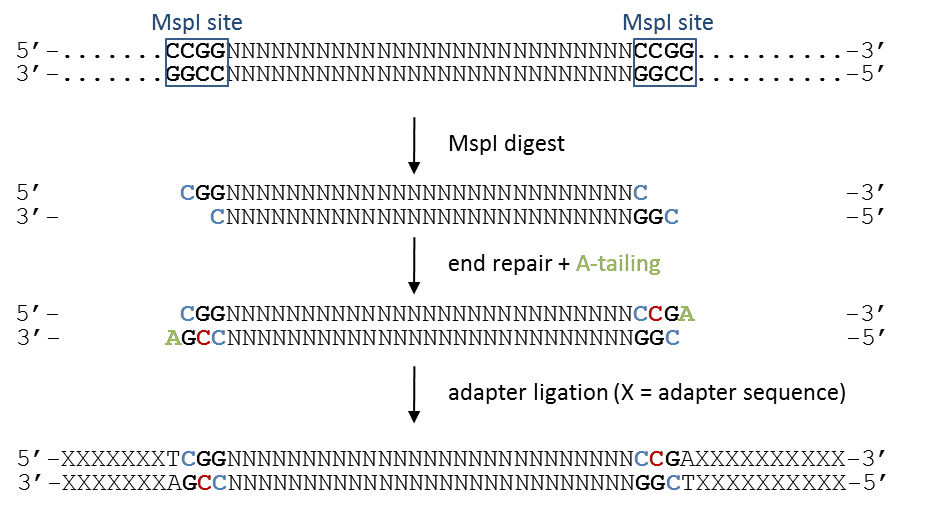
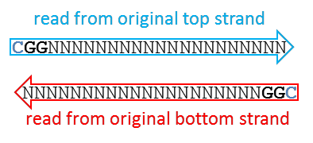
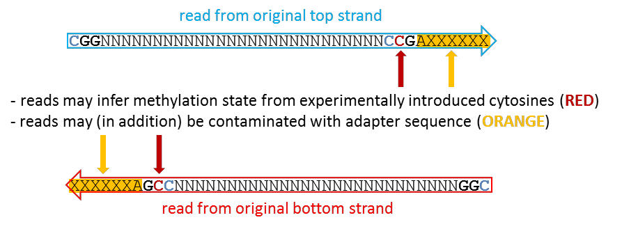

Directional sequencing, the most wide-spread way of (RR)BS, only ever sequences reads originating from the original top (OT) or original bottom (OB) strands. For simplicity, I have refrained from drawing out all four bisulfite DNA strands for the illustration below.

## The sequential steps of RRBS

Cytosines in blue retain the original genomic methylation state, whereas cytosines in red are introduced experimentally during the fragment end-repair reaction. This can be accomplished with either unmethylated or methylated cytosines, the trend seems to be that unmethylated cytosines are being used primarily now.

After the adapters are attached, the sequences are treated with sodium bisuflite, which converts unmethylated cytosines into thymines. Thus, the first three bases of (almost) all RRBS reads are either CGG or TGG, depending on their genomic methylation state. This applies to reads from both the OT and OB strand, and as nearly all reads in a directional RRBS experiment start with one of these two options, every read provides information on at least one CpG right in the start.

For directional libraries one can then discrimate the following two cases:

### A) The read length is shorter than the MspI fragment

In this case, the entire read can be used for alignments and methylation calls. The first position resembles the true genomic methylation state (which can be C or T).

### B) The read length is longer than the MspI fragment size

In this case, the sequencing read will contain the position which has been filled in during the end repair step (marked in RED), as well as read into the adapter sequence on the 3' end of the read (marked in ORANGE). Retaining either the biased position or adapter contamination in the sequence read is highly undesirable.

## What Trim Galore does

For directional RRBS libraries, [`--rrbs`](/TrimGalore/modes/rrbs/) handles case **B**:

- Adapter trimming removes the orange adapter contamination at the 3' end.
- The extra 2 bp 3'-clip on adapter-trimmed reads removes the red filled-in cytosine position close to the second MspI site.
- For paired-end libraries, `--clip_R2 2` is auto-set to remove the equivalent fill-in artifact at the 5' end of Read 2.

Reads in case **A** (shorter than the fragment) are not affected by this extra clip; the trimming only kicks in when an adapter was actually detected.
