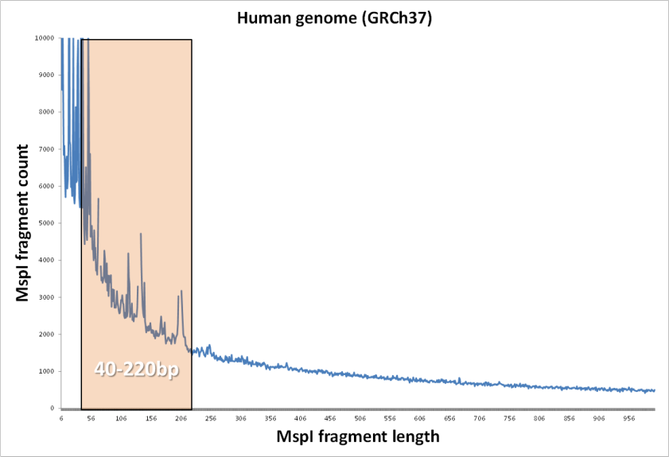
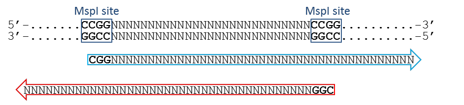
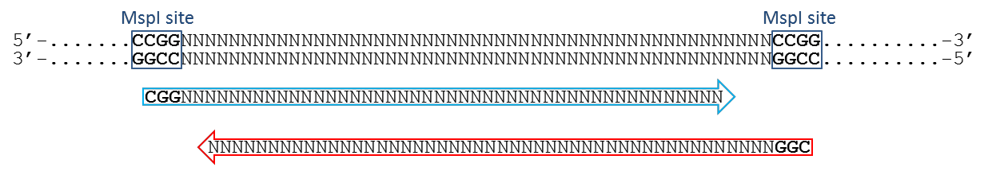
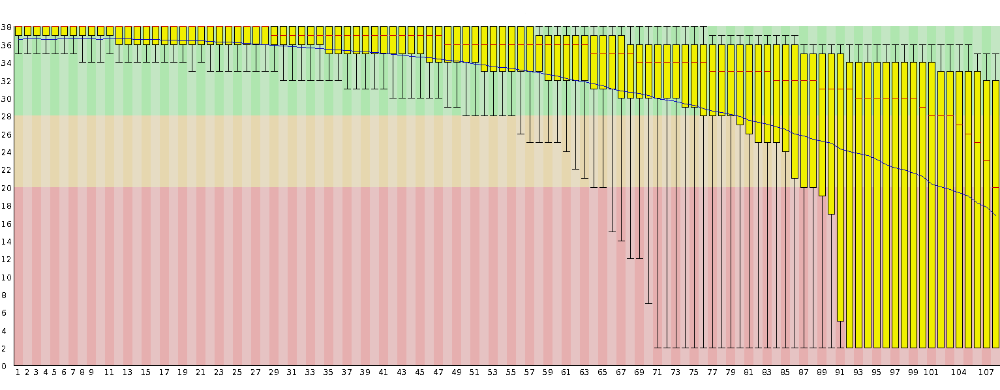

This guide is a slightly modernised version of [Felix Krueger's 2018 RRBS_Guide.pdf](https://github.com/FelixKrueger/TrimGalore/blob/master/docs_old/RRBS_Guide.pdf), restructured for the docs site. The biology is unchanged.

## What is RRBS?

Typically, RRBS samples are generated by digesting genomic DNA with the restriction endonuclease MspI. This is followed by end-repair, A-tailing, adapter ligation and finally bisulfite conversion. Often, the library is also size-selected for fragments between 40 and 220bp in length. This fragment size has been shown to be plentiful in the sample and yield information on the vast majority of CpG islands (CGIs) in the human or mouse genome. Fig. 1 shows that quite a few MspI-MspI fragments (generated in silico for the mouse genome) are even shorter than 40bp. Since the size selection process if not as good as it is in theory, often a sizeable number of fragments below 40bp can end up in the RRBS library.

The fairly small fragment size of RRBS fragments can become a potential problem especially for sequencing reads with high read length (e.g. > 75bp or > 100bp). If the read length is longer than the MspI-MspI fragment itself, the sequencing read may continue to read into the adapter sequence on the 3' end:

Such read-through adapter contamination may result in a lower mapping efficiency if the read does not align at all, or it may lead to false alignments which can result in incorrect methylation calls. As a simple rule, the longer the read length the higher the proportion of reads with adapter contamination. If such adapter contamination is not spotted and removed appropriately, a longer read length is most likely resulting in a lower mapping efficiency!

If the read length is longer than the MspI fragment one will also read (and perform a methylation call) for a cytosine that has been filled in with a predefined methylation state during the end-repair step. This is discussed further in [Directional libraries](/TrimGalore/rrbs/directional/) and [Non-directional & paired-end](/TrimGalore/rrbs/non-directional/).

## Single-end or paired-end?

It seems to be a common misconception, that paired-end reads yield methylation results for both the forward and the reverse strand. In reality, a paired-end read results from PCR amplification of either the original top strand (OT), or the original bottom strand (OB). Thus, the other ends that are sequenced in the second round are sequences from the strand complementary to OT (CTOT), or complementary to OB (CTOB). These complementary strands are also informative for the same strand as their partner reads. As a consequence, paired-end reads that overlap in the middle yield redundant methylation information for the same strand:

Granted, the paired-end nature might result in a somewhat increased mapping efficiency of paired-end reads over single-end reads. However, in addition to reading into the adapter on the other side, paired-end reads face the additional problem of generating potentially redundant methylation information. Redundant methylation calls need to be discarded if positions are filtered for a certain coverage by independent reads, since regions of overlap for paired-end reads would be over-represented. In short, because of the redundant overlapping parts paired-end RRBS reads are not simply 'twice as many reads therefore twice as many methylation calls'. Single-end experiments with the same number of reads as both paired-end reads added together are more likely to yield more genuine methylation information, as long as the read length is long enough to allow for a fair mapping efficiency for single-end reads (40-50bp reads are probably long enough to get mapping efficiencies in the range of 60 to 70%).

## Other read length effects

Current sequencing on the Illumina platform often produces data whose quality deteriorates towards later cycles. We have received feedback from numerous sources, or downloaded data from public archives, which looks similar to this read quality profile:

Up to a read length of around 60-70bp, the basecall quality of these reads is excellent (> Phred 30). After that, however, Phred scores tend to drop dramatically in a fairly large number of sequences, which means the rates at which bases are called erroneously increases. Base call errors in reads can result in reads not being aligned at all (reduced mapping efficiency), incorrect methylation calls or, in the worst case, mis-alignments (which will most likely also generate incorrect methylation calls). Some of these aspects have been recently discussed in the following review: Krueger F., Kreck B. et al., DNA Methylome Analysis Using Short Bisulfite Read Data, 2012.

## In a nutshell

RRBS reads suffer disproportionally from problems associated with long read lengths because they are, compared to other -Seq applications, size-selected for rather short fragment sizes. In the following sections, I will discuss some further aspects that need to be considered when analysing RRBS samples, and I will introduce our way of dealing with all sorts of read length related problems or experimentally introduced biases for RRBS libraries.

- [Directional libraries](/TrimGalore/rrbs/directional/). OT / OB strands only.
- [Non-directional & paired-end](/TrimGalore/rrbs/non-directional/). All four bisulfite strands.
- [QC measures for RRBS](/TrimGalore/rrbs/qc/). What to check, and how Trim Galore helps.
