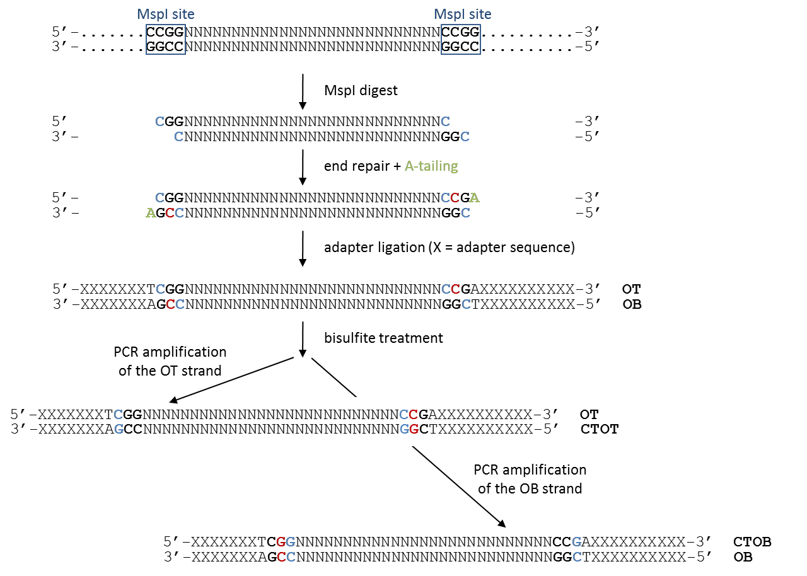
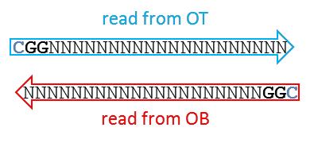
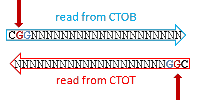
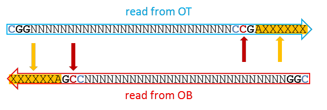
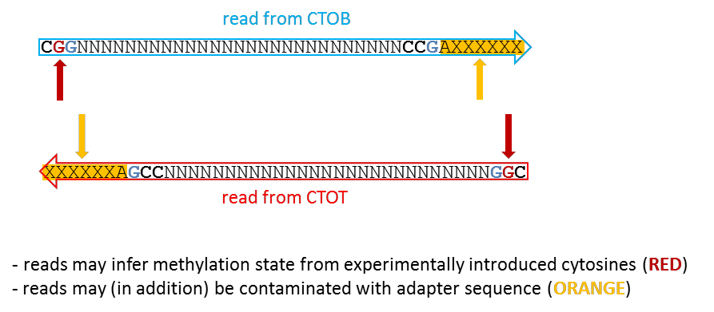

Non-directional bisulfite sequencing is less common, but has been performed in a number of studies (Cokus et al. (2008), Popp et al. (2010), Smallwood et al. (2011), Hansen et al. (2011), Kobayashi et al. (2012)). In this type of library, sequence reads may originate from all four possible bisulfite DNA strands (original top (OT), complementary to OT (CTOT), original bottom (OB) or complementary to OB (CTOB)) with roughly the same likelihood.

Paired-end reads do by definition contain one read from one of the original strands as well as one complementary strand. Please note that the CTOT or CTOB strands in a read pair are reverse-complements of the OT or OB strands, respectively, and thus they carry methylation information for the exact same strand as their partner read but not for the other original DNA strand. Similar to directional single-end libraries, the first read of directional paired-end libraries always comes from either the OT or OB strand. The first read of non-directional paired-end libraries may originate from any of the four possible bisulfite strands.

## How non-directional libraries are built

Again, cytosines in blue retain the original genomic methylation state, whereas cytosines in red are introduced experimentally during the fragment end-repair reaction. This can be accomplished with either unmethylated or methylated cytosines, the trend seems to be that unmethylated cytosines are being used primarily now.

After bisulfite conversion, the first three bases of non-directional RRBS reads that originated from the OT or OB strands will also be either CGG or TGG, depending on their genomic methylation state. In addition, however, non-directional libraries may contain reads which originated from the CTOT or CTOB strands. These reads will have CAA or CGA at the start, depending on whether unmethylated or methylated cytosines were used for the end-repair reaction, respectively. (Theoretically, the sequence could also be CAG or CGG, but this would assume that a C in CHH context was methylated on the other strand, and this is arguably very rarely the case for CpG-rich sequences. For simplicity it is therefore left out here). In either case, the second base would incur a methylation call of a base that does no longer reflect the genomic methylation state, which is illustrated below.

For non-directional libraries, one can discriminate the following four cases:

### A) The read length is shorter than the MspI fragment, OT or OB alignments

In this case, the entire read can be used for alignments and methylation calls. The first position resembles the true genomic methylation state (which can be C or T).

### B) The read length is shorter than the MspI fragment, CTOT or CTOB alignments

In this case, the read will start with CAA or CGA (the filled-in and the other cytosine in CHG context on the opposing strand are expected to be fully bisulfite converted), whereby the position marked in RED infers the methylation state from a cytosine that was experimentally introduced. The positions in BLUE carries genomic methylation information. As a consequence, methylation information of the second base would bias the results depending on the methylation state of the cytosine used for end-repair and needs to be excluded from methylation analysis.

### C) The read length is longer than the fragment length, OT or OB alignments

Analogous to directional libraries, the sequencing read will contain the position that was filled in during the end-repair step (marked in RED), as well as read into the adapter sequence on the 3' end of the read (marked in ORANGE). Retaining either the biased position or adapter contamination in the sequence read is highly undesirable.

### D) The read length is longer than the fragment length, CTOT or CTOB alignments

Similar to case **B**, the read does now contain the filled-in base at position 2 in the read (typically CAA or CGA, RED), as well as adapter contamination at the 3' end (ORANGE). Retaining either the biased position or adapter contamination in the sequence read is highly undesirable.

## What Trim Galore does

For non-directional libraries, [`--rrbs --non_directional`](/modes/rrbs/#non-directional-mode) handles cases **B**, **C**, and **D**:

- `--rrbs` removes the 3' fill-in artifact and adapter contamination (cases C, D).
- `--non_directional` screens adapter-trimmed sequences for the presence of either CAA or CGA at the start of sequences and clips off the first 2 bases if found (cases B, D, the CTOT/CTOB-derived reads).

In `--non_directional` mode, if `CAA` or `CGA` is found at the start, no bases will be trimmed off from the 3' end even if the sequence had some contaminating adapter sequence removed (in this case the sequence read likely originated from either the CTOT or CTOB strand).

The auto `--clip_R2 2` that directional `--rrbs` applies is intentionally skipped in non-directional mode, since the 5' bias on Read 2 is handled by the start-clip logic instead.
