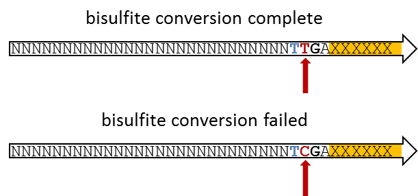

As for almost all high throughput sequencing applications we would recommend to perform some quality control on the data, as it can often straight away point you towards the next steps that need to be taken (e.g. with [FastQC](http://www.bioinformatics.babraham.ac.uk/projects/fastqc/)). As outlined in [A brief guide to RRBS](/TrimGalore/rrbs/guide/), [Directional libraries](/TrimGalore/rrbs/directional/), and [Non-directional & paired-end](/TrimGalore/rrbs/non-directional/), we believe that thorough QC and taking appropriate steps to remove problems is absolutely critical for proper analysis of RRBS libraries since they are susceptible to a variety of errors or biases that one could probably get away with in other sequencing applications. In summary, the examples discussed here were:

- poor qualities. Affect mapping, may lead to incorrect methylation calls and/or mis-mapping.
- adapter contamination. May lead to low mapping efficiencies, or, if mapped, may result in incorrect methylation calls and/or mis-mapping.
- positions filled in during end-repair will infer the methylation state of the cytosine used for the fill-in reaction but not of the true genomic cytosine.
- paired-end RRBS libraries (especially with long read length) yield redundant methylation information if the read pairs overlap.
- RRBS libraries with long read lengths suffer more from all of the above due to the short size-selected fragment size.

## How Trim Galore addresses each issue

| Issue | What `trim_galore` does | Flag(s) |
|-------|-------------------------|---------|
| Poor 3' qualities | BWA-style Phred trimming from the 3' end | `-q` (default 20); `--2colour N` for 2-colour instruments |
| Adapter contamination | Auto-detected adapter, semi-global alignment, 1 bp default stringency | (auto) or `--illumina` / `--nextera` / `--small_rna` / `--stranded_illumina` / `--bgiseq` |
| End-repair fill-in (R1, 3' end) | 2 bp clip on adapter-trimmed reads | `--rrbs` |
| End-repair fill-in (R2, 5' end, directional) | Auto 2 bp 5' clip on R2 | `--rrbs` (paired-end, directional) auto-sets `--clip_R2 2` |
| CTOT/CTOB start bias (non-directional) | Strip first 2 bp if read starts with CAA/CGA | `--non_directional` |
| Read pairs that became too short | Drop pair (or rescue singletons) | `--length`, `--retain_unpaired`, `--length_1`, `--length_2` |
| 2-colour no-signal G-runs | Sequence-based poly-G trim | `--poly_g` (auto-detected on 2-colour data) |

## Exploiting the filled-in position to determine the bisulfite conversion efficiency

If the end-repair was performed using unmethylated cytosines, this position can theoretically be exploited as a built-in bisulfite conversion efficiency control. To assess the bisulfite conversion efficiency one needs to identify sequences that contain the adapter on their 3' end, and count up the number of times the filled in position (marked in RED) was not converted to T.



The percentage of non-bisulfite converted cytosines at the fill-in position can be calculated as:

```
% non-conversion = CX / (TY + CX) * 100
```

(with X and Y being the number of times these residues were observed).

To make this calculation more reliable one can vary the required overlaps with the adapter sequence, e.g. requiring 3, 5, 7bp etc., before the non-conversion rate of the filled-in position is determined.

## Recommended downstream tooling

After trimming with Trim Galore, the standard RRBS workflow is:

1. **Alignment** with [Bismark](https://github.com/FelixKrueger/Bismark).
2. **Methylation extraction** with `bismark_methylation_extractor`.
3. **Deduplication** as appropriate (e.g. [UmiBam](https://github.com/FelixKrueger/Umi-Grinder) for UMI libraries).
4. **Reporting** with [MultiQC](https://multiqc.info), which natively parses the Trim Galore text and JSON reports.
