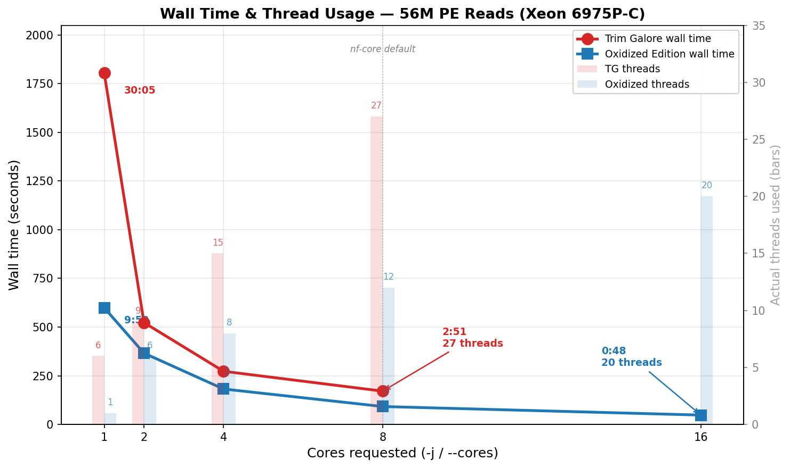
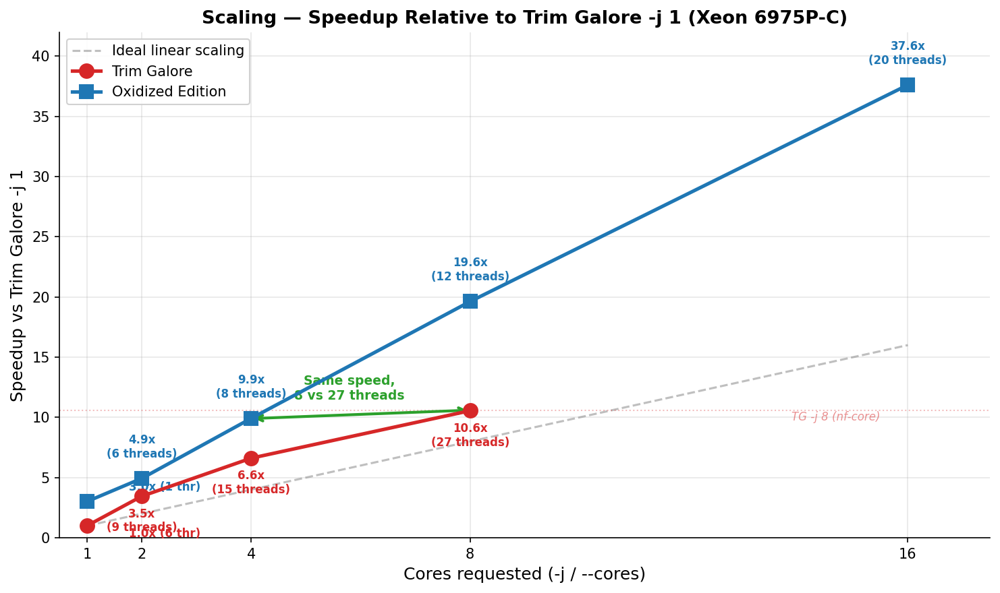
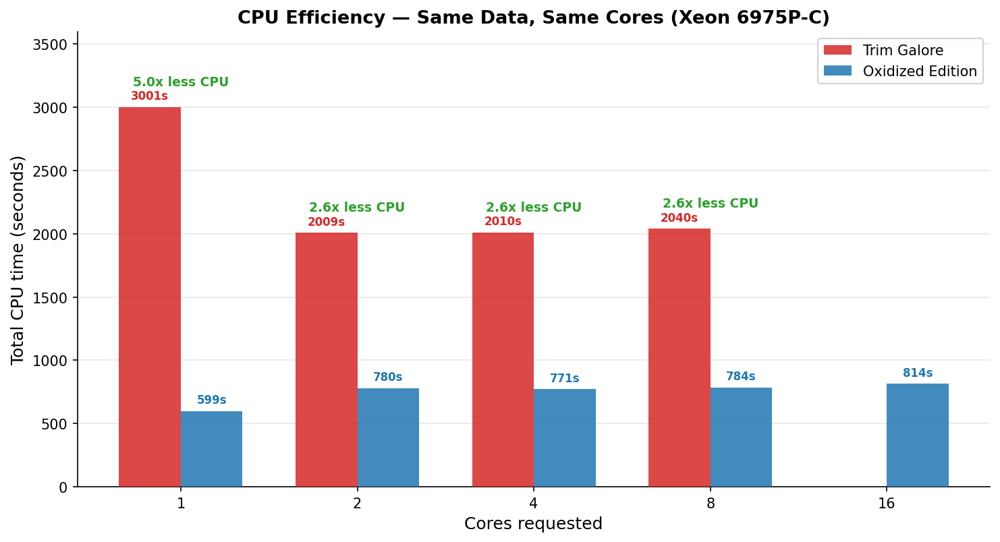

# Trim Galore — Oxidized Edition

## What was built

A complete **Rust rewrite of Trim Galore** that produces **byte-identical output** to the Perl original across every feature and test case. It's a true drop-in replacement — same CLI flags, same output filenames, same report format compatible with MultiQC.

**Architecture shift:** Trim Galore (Perl) is a wrapper that shells out to Cutadapt (Python/Cython) for adapter matching. The Oxidized Edition does everything in a single process — adapter detection, alignment, quality trimming, adapter removal, filtering — in one pass through the data. Paired-end reads are processed in a single pass rather than two sequential Cutadapt runs.

## Feature parity

| Feature | Status |
|---------|--------|
| Adapter auto-detection (Illumina/Nextera/smallRNA/BGI/Stranded) | Done |
| Quality trimming (BWA algorithm, Phred33/64) | Done |
| Adapter trimming (semi-global alignment with error rate) | Done |
| Paired-end single-pass processing | Done |
| `--rrbs` / `--non_directional` | Done |
| `--nextseq` / `--2colour` | Done |
| `--consider_already_trimmed` | Done |
| `--poly_a` trimming | Done |
| `--hardtrim5` / `--hardtrim3` | Done |
| `--clock` (Epigenetic Clock UMI) | Done |
| `--implicon` (UMI from R2) | Done |
| `--demux` (3' barcode demultiplexing) | Done |
| `--fastqc` / `--fastqc_args` | Done |
| `--rename`, `--trim-n`, `--max_n`, `--max_length` | Done |
| `--retain_unpaired`, `--clip_R1/R2`, `--three_prime_clip_R1/R2` | Done |
| `--cores N` (worker-pool parallelism) | Done |
| Trimming reports (MultiQC-compatible) | Done |
| Colorspace rejection | Done |

## Performance

**Test dataset:** 55.8M paired-end reads (SRR24827378, whole-genome bisulfite sequencing).
All outputs verified byte-identical (decompressed) across all core counts via md5 checksums.







### Server benchmark — Intel Xeon 6975P-C (32 vCPU)

#### Trim Galore (Perl 5.38 + Cutadapt 5.2 + pigz 2.8 + isal)

| `-j` | Wall time | CPU time | Memory | Actual threads |
|-----:|----------:|---------:|-------:|---------------:|
| 1 | 30:05 (1,805s) | 3,001s | 21 MB | ~6 |
| 2 | 8:43 (523s) | 2,009s | 39 MB | ~9 |
| 4 | 4:33 (273s) | 2,010s | 42 MB | ~15 |
| 8 | 2:51 (171s) | 2,040s | 61 MB | ~27 |

#### Trim Galore — Oxidized Edition (Rust, zlib-rs)

| `--cores` | Wall time | CPU time | Memory | Actual threads |
|----------:|----------:|---------:|-------:|---------------:|
| 1 | 9:59 (599s) | 599s | 5 MB | 1 |
| 2 | 6:06 (366s) | 780s | 43 MB | 6 |
| 4 | 3:02 (182s) | 771s | 62 MB | 8 |
| 8 | 1:32 (92s) | 784s | 100 MB | 12 |
| **16** | **0:48 (48s)** | **814s** | **171 MB** | **20** |

#### Head-to-head (same core count)

| Cores | TG wall | Oxidized wall | **Wall speedup** | TG CPU | Oxidized CPU | **CPU savings** |
|------:|--------:|--------------:|-----------------:|-------:|-------------:|----------------:|
| 1 | 1,805s | 599s | **3.0x** | 3,001s | 599s | **5.0x** |
| 4 | 273s | 182s | **1.5x** | 2,010s | 771s | **2.6x** |
| 8 | 171s | 92s | **1.9x** | 2,040s | 784s | **2.6x** |

#### Production comparison: nf-core default (`--cores 8`)

In nf-core pipelines, Trim Galore is typically run with `--cores 8`, which spawns ~27 threads (8 Cutadapt workers + 8 pigz compress + 8 pigz decompress + 3 overhead).

| | Trim Galore `-j 8` | Oxidized `--cores 8` | Oxidized `--cores 4` |
|---|---|---|---|
| **Wall time** | 171s | **92s (1.9x faster)** | 182s (same speed) |
| **CPU time** | 2,040s | **784s (2.6x less)** | 771s (2.6x less) |
| **Threads used** | ~27 | 12 | 8 |
| **Memory** | 61 MB | 100 MB | 62 MB |

The Oxidized Edition at `--cores 4` (8 threads) **matches Trim Galore `-j 8` (27 threads) in wall time** while using 2.6x less CPU and less than a third of the threads. At `--cores 8`, it's nearly **twice as fast**. At `--cores 16`, it processes 56M PE reads in **48 seconds** — and still uses 2.5x less CPU than Trim Galore `-j 8`.

### Laptop benchmark — Apple M1 Pro (10 cores)

#### Trim Galore (Perl 5.34 + Cutadapt 4.9 + pigz)

| `-j` | Wall time | CPU time |
|-----:|----------:|---------:|
| 1 | 27:04 (1,624s) | 2,536s |
| 2 | 13:50 (830s) | 2,741s |
| 4 | 7:15 (435s) | 2,868s |

#### Trim Galore — Oxidized Edition

| `--cores` | Wall time | CPU time | Speedup vs TG `-j 1` |
|----------:|----------:|---------:|----------------------:|
| 1 | 11:46 (706s) | 695s | 2.3x |
| 2 | 7:16 (436s) | 908s | 3.7x |
| 4 | 3:46 (226s) | 936s | 7.2x |
| 6 | 2:35 (155s) | 957s | 10.5x |
| 8 | 2:03 (123s) | 994s | 13.2x |

### Why the speedup is larger than "Rust is faster"

**The bottleneck is gzip, not trimming.** The actual trimming logic (adapter alignment, quality clipping) is ~5% of runtime — the other 95% is gzip compression (~60%) and decompression (~30%). Rust's speed advantage over Perl/Python only applies to that 5%.

The real wins come from **architectural differences:**

1. **Single-pass vs three-pass.** Trim Galore runs Cutadapt on R1, then R2, then pair-validates — reading and recompressing the data three separate times. The Oxidized Edition does everything in one pass.

2. **Worker-pool parallelism.** Each worker independently handles trimming **and** gzip compression for its batch of reads, producing independently-compressed gzip blocks concatenated in order (valid per RFC 1952). This distributes the dominant cost (compression) across N workers instead of funneling through one thread.

3. **Fewer threads, more work per thread.** When you pass `-j N` to Trim Galore, three separate programs each independently spawn N threads:

```
Trim Galore -j N thread breakdown:
  Cutadapt:          N workers + 1 reader + 1 writer  =  N+2
  pigz (compress):   N threads                         =  N
  pigz (decompress): N threads                         =  N
  Perl:              1 main process                    =  1
                                                       ≈ 3N+3 total
```

The Oxidized Edition uses a single process with a fixed infrastructure cost of +4 threads:

```
Oxidized Edition --cores N thread breakdown:
  N worker threads (each: trim + gzip compress → independent gzip block)
  2 decompression threads (one per input file)
  1 batcher thread (creates numbered batches of 4096 reads)
  1 main thread (collects blocks in order → writes to output files)
                                                       = N+4 total
```

At `--cores 1`, the worker-pool is bypassed entirely — a single thread does everything with zero parallelism overhead (1 thread, 5 MB RAM). The infrastructure cost only applies from `--cores 2` upward, where each additional core adds exactly 1 thread and ~10 MB of memory.

| Cores | TG threads (3N+3) | Oxidized threads (N+4) |
|------:|-------------------:|-----------------------:|
| 1 | 6 | 1 |
| 4 | 15 | 8 |
| 8 | 27 | 12 |
| 16 | — | 20 |

At `-j 8` vs `--cores 8`: 27 threads vs 12 threads, yet 1.9x faster.

Parallel efficiency on the Xeon: 82% (2 cores) → 82% (4 cores) → 81% (8 cores) → 78% (16 cores). The gentle slope means adding more cores continues to pay off up to at least 16.

## Beyond speed

- **Zero external dependencies:** No Python, no Cutadapt, no pigz. Single static binary.
- **Simpler deployment:** `cargo install` or download a binary. No conda environment needed.
- **Single-pass paired-end:** Both reads processed together — guaranteed synchronization, no temp files.
- **Lower memory:** 5 MB single-threaded, ~10 MB per additional worker. No Python interpreter, no subprocess pipes.
- **CPU-efficient:** Uses 2.6–5x less CPU time than Trim Galore — meaningful on shared HPC clusters where CPU-hours = money.
- **Reproducible:** Pure Rust with deterministic behavior across platforms.
